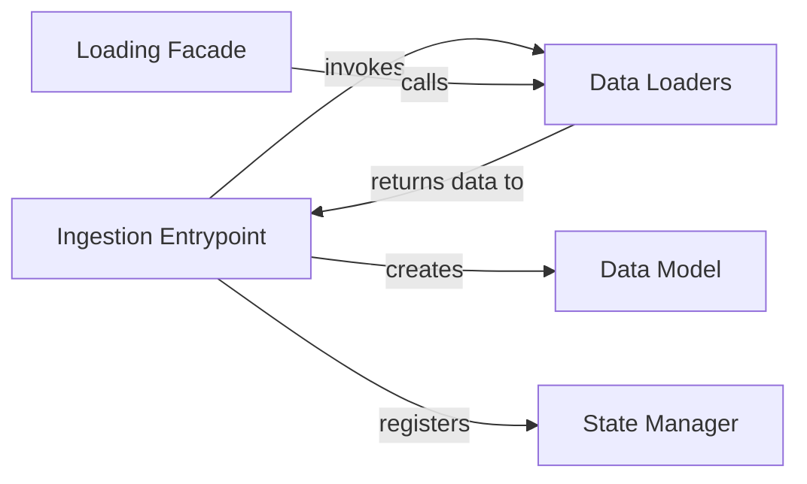

## Details

The data ingestion layer is structured as a processing pipeline. The design separates the request handling, data loading logic, and state management into distinct, single-responsibility components. This architecture is justified by its clarity and modularity: `Ingestion Entrypoint` acts as the controller, `Data Loaders` provide format-specific parsing, `Data Model` standardizes the output, and the `State Manager` makes the data globally accessible. The `Loading Facade` offers a simplified entry point for common use cases, enhancing usability.

### Ingestion Entrypoint
Serves as the primary controller for data ingestion. It handles incoming requests from the UI or other entry points, orchestrates the data loading process by invoking the appropriate loader, and registers the resulting data object with the application's state manager.

**Related Classes/Methods**:

- <a href="https://github.com/man-group/dtale/blob/master/dtale/views.py#L909-L1300" target="_blank" rel="noopener noreferrer">`dtale.views:startup` (909:1300)</a>

### Data Loaders
A collection of specialized modules responsible for the low-level logic of reading data from various sources (e.g., CSV, JSON, R, Stata). Each loader parses a specific format and converts it into a standardized pandas DataFrame, abstracting the format-specific details from the rest of the application.

**Related Classes/Methods**:

- `dtale.cli.loaders.csv_loader`
- `dtale.cli.loaders.json_loader`
- `dtale.cli.loaders.stata_loader`
- `dtale.cli.loaders.r_loader`

### Loading Facade
Provides a simplified, high-level API for loading pre-configured or sample datasets. It acts as a convenience layer over the more complex `Data Loaders`, offering a straightforward way to populate the application with data without manual configuration.

**Related Classes/Methods**:

- `dtale.datasets`

### Data Model
The central data structure that encapsulates the ingested data. It holds the pandas DataFrame and all associated metadata (e.g., data types, column information, settings). This object is the standardized output of the ingestion process and is used throughout the application for analysis and visualization.

**Related Classes/Methods**:

- <a href="https://github.com/man-group/dtale/blob/master/dtale/views.py#L216-L717" target="_blank" rel="noopener noreferrer">`dtale.views:DtaleData` (216:717)</a>

### State Manager
A crucial singleton component that manages the lifecycle and global accessibility of all active `DtaleData` instances. After data is ingested, the `Data Model` instance is registered here, making it available across different user sessions and application modules via a unique identifier.

**Related Classes/Methods**:

- `dtale.global_state`

### [FAQ](https://github.com/CodeBoarding/GeneratedOnBoardings/tree/main?tab=readme-ov-file#faq)