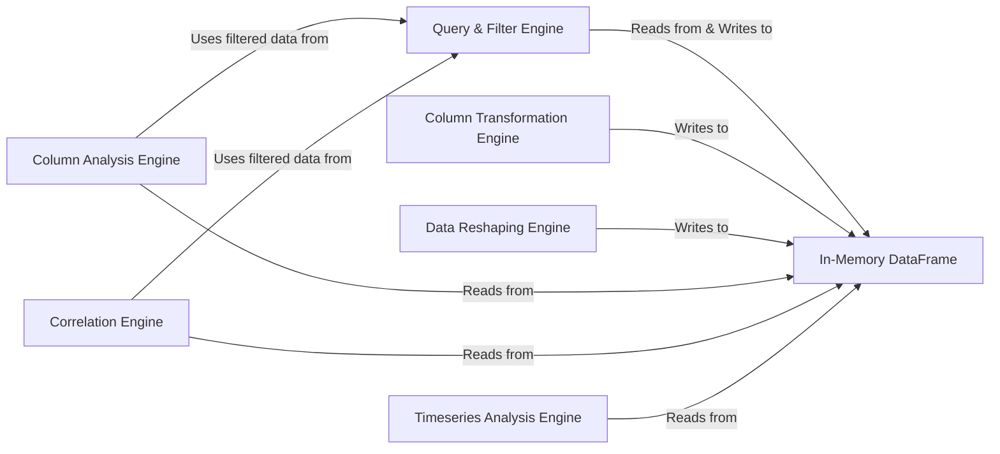

## Details

This analysis provides a synthesized overview of the Data Processing & Analysis Engine subsystem. The components were chosen by consolidating granular classes into larger, architecturally significant engines based on their core function. This approach reduces complexity while highlighting the primary capabilities of the subsystem. The subsystem is composed of several engines that operate on a central In-Memory DataFrame. The Query & Filter Engine is the entry point for data manipulation. The Column Analysis, Column Transformation, and Data Reshaping Engines handle core data processing tasks. Specialized engines for Correlation and Timeseries analysis provide more advanced analytical capabilities.

### Query & Filter Engine
Manages and applies filters to the in-memory DataFrame. It uses specialized filter objects for different data types (numeric, string, date) to construct and execute queries.

**Related Classes/Methods**:

- `dtale.query`
- `dtale.column_filters`

### Column Analysis Engine
Acts as a factory that selects and executes the appropriate analysis for a given column based on its data type. It orchestrates detailed statistical analyses like histograms, value counts, and categorical breakdowns.

**Related Classes/Methods**:

- `dtale.column_analysis`

### Column Transformation Engine
A factory for building new columns by applying transformations to existing ones. It supports operations like binning, type conversions, and string manipulation.

**Related Classes/Methods**:

- `dtale.column_builders`

### Data Reshaping Engine
Handles structural transformations of the entire DataFrame. It orchestrates complex operations like pivoting, aggregation, and transposing data.

**Related Classes/Methods**:

- `dtale.data_reshapers`

### Correlation Engine
A specialized component for calculating and visualizing correlation matrices between numeric columns in the DataFrame.

**Related Classes/Methods**:

- `dtale.correlations`

### Timeseries Analysis Engine
A specialized engine for time-series specific analyses, such as seasonal decomposition, resampling, and applying temporal filters (e.g., Hodrick-Prescott).

**Related Classes/Methods**:

- `dtale.timeseries_analysis`

### In-Memory DataFrame
The central data structure (a pandas.DataFrame) that holds the dataset. It is the passive object that all active engine components read from and write to.

**Related Classes/Methods**:

- `pandas.DataFrame`

### [FAQ](https://github.com/CodeBoarding/GeneratedOnBoardings/tree/main?tab=readme-ov-file#faq)