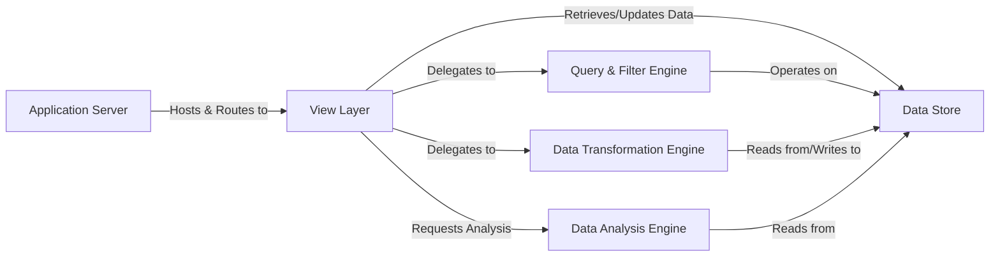

## Details

One paragraph explaining the functionality which is represented by this graph. What the main flow is and what is its purpose.

### Application Server
The core Flask web server. It initializes the application, manages configuration, and serves as the host for the entire backend, routing HTTP requests to the appropriate views.

**Related Classes/Methods**:

- `dtale.app`

### View Layer
The primary API gateway. It interprets incoming HTTP requests from the frontend, parses user actions, and orchestrates calls to the various data processing engines.

**Related Classes/Methods**:

- `dtale.views`

### Data Store [[Expand]](./Data_Store.md)
A state management layer responsible for the lifecycle of DataFrame instances. It provides an abstraction for storing, retrieving, and managing data, supporting backends like in-memory, Shelve, and Redis.

**Related Classes/Methods**:

- `dtale.global_state`

### Query & Filter Engine
Executes data subsetting operations. It constructs and applies queries and filters based on user-defined criteria, efficiently slicing the DataFrames managed by the Data Store.

**Related Classes/Methods**:

- `dtale.query`
- `dtale.column_filters`

### Data Transformation Engine
The main engine for data manipulation. It handles a wide range of operations, including creating new columns, reshaping data structures (pivoting, melting), and cleaning or replacing values.

**Related Classes/Methods**:

- `dtale.column_builders`
- `dtale.data_reshapers`
- `dtale.column_replacements`

### Data Analysis Engine
Performs statistical analysis on the data. Unlike transformation, this component computes descriptive statistics, correlations, histograms, and other analytical outputs without altering the underlying dataset.

**Related Classes/Methods**:

- `dtale.column_analysis`
- `dtale.timeseries_analysis`

### [FAQ](https://github.com/CodeBoarding/GeneratedOnBoardings/tree/main?tab=readme-ov-file#faq)