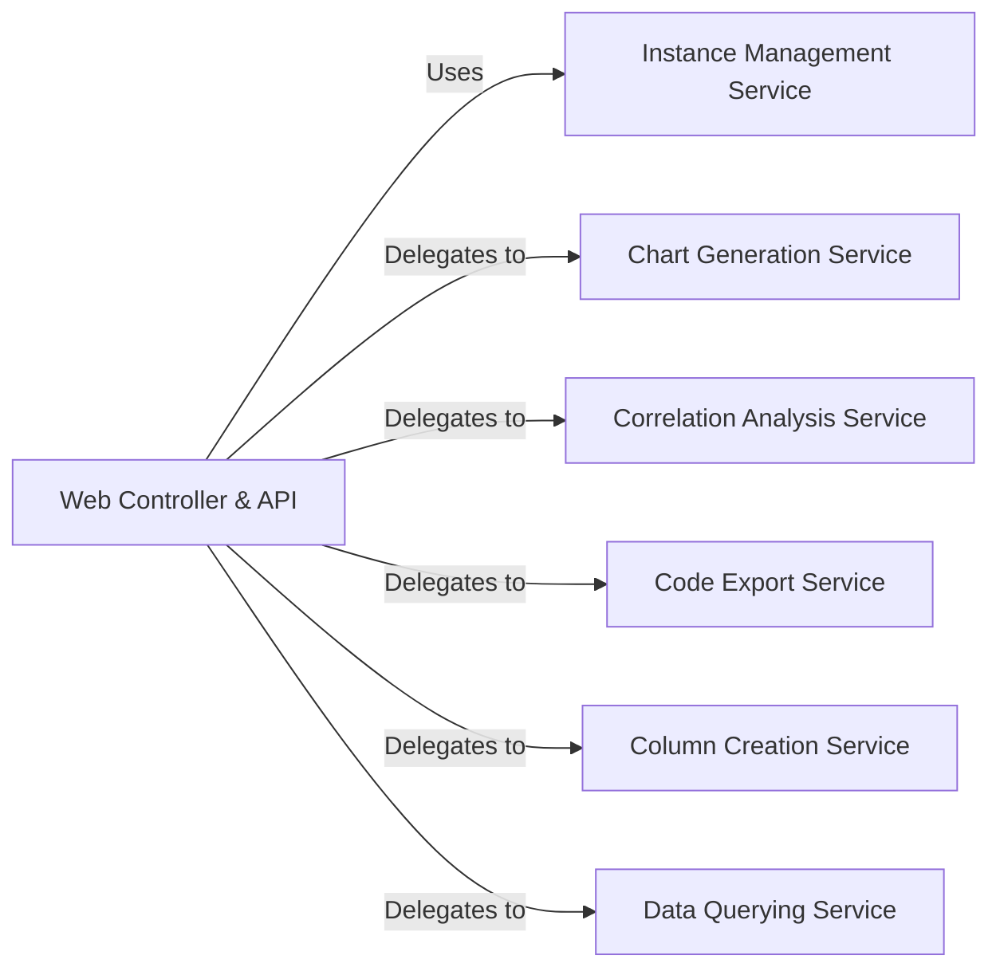

## Details

One paragraph explaining the functionality which is represented by this graph. What the main flow is and what is its purpose.

### Web Controller & API
The central entry point for all HTTP requests from the frontend. It uses Flask to define API endpoints, handles request parsing, and orchestrates data operations. It interacts with the `Instance Management Service` to retrieve the appropriate data instance and then delegates tasks to specialized services like charting, querying, or analysis.

**Related Classes/Methods**:

- <a href="https://github.com/man-group/dtale/blob/master/dtale/views.py" target="_blank" rel="noopener noreferrer">`dtale.views`</a>

### Instance Management Service
A state management service responsible for the lifecycle of data instances within the application. It acts as a global registry, handling the creation, storage (in-memory, on-disk, or Redis), and retrieval of `DtaleInstance` objects. This component ensures that the state of each dataset is maintained and accessible across different user requests.

**Related Classes/Methods**:

- <a href="https://github.com/man-group/dtale/blob/master/dtale/global_state.py" target="_blank" rel="noopener noreferrer">`dtale.global_state`</a>

### Data Querying Service
A specialized service responsible for filtering data and retrieving specific subsets based on user-defined queries. It is invoked by the `Web Controller & API` to apply filters to the underlying DataFrame within a `DtaleInstance`.

**Related Classes/Methods**:

- <a href="https://github.com/man-group/dtale/blob/master/dtale/query.py" target="_blank" rel="noopener noreferrer">`dtale.query`</a>

### Chart Generation Service
A service dedicated to creating chart configurations for data visualization. It takes a data instance and user specifications as input and generates the JSON structure required by the frontend charting libraries.

**Related Classes/Methods**:

- <a href="https://github.com/man-group/dtale/blob/master/dtale/charts/utils.py" target="_blank" rel="noopener noreferrer">`dtale.charts.utils`</a>

### Column Creation Service
A service that handles the logic for building new columns in a DataFrame based on user input. This includes applying functions or transformations to existing columns to derive new ones.

**Related Classes/Methods**:

- <a href="https://github.com/man-group/dtale/blob/master/dtale/column_builders.py" target="_blank" rel="noopener noreferrer">`dtale.column_builders`</a>

### Correlation Analysis Service
A service responsible for performing correlation analysis on the dataset. It computes the correlation matrix for numeric columns and prepares the results for display in the frontend.

**Related Classes/Methods**:

- <a href="https://github.com/man-group/dtale/blob/master/dtale/correlations.py" target="_blank" rel="noopener noreferrer">`dtale.correlations`</a>

### Code Export Service
A service that generates equivalent Python code snippets (primarily using pandas) for the sequence of operations performed by the user within the D-Tale interface. This allows for reproducibility and integration into other workflows.

**Related Classes/Methods**:

- <a href="https://github.com/man-group/dtale/blob/master/dtale/code_export.py" target="_blank" rel="noopener noreferrer">`dtale.code_export`</a>

### [FAQ](https://github.com/CodeBoarding/GeneratedOnBoardings/tree/main?tab=readme-ov-file#faq)