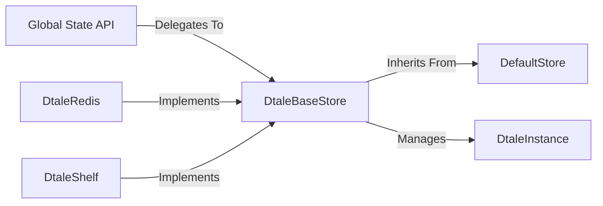

## Details

One paragraph explaining the functionality which is represented by this graph. What the main flow is and what is its purpose.

### Global State API
A set of global functions that act as a facade, providing a simplified, high-level interface to the active data store. It decouples the application from the storage implementation details, allowing components to request or update data without knowing how it's stored.

**Related Classes/Methods**:

- `dtale/global_state.py`

### DefaultStore
The foundational, dictionary-based, in-memory storage implementation. It provides the baseline functionality for storing `DtaleInstance` objects in a simple dictionary, making it fast and ideal for standard, single-process use cases.

**Related Classes/Methods**:

- `dtale/global_state.py`

### DtaleBaseStore
The primary store class that inherits from `DefaultStore`. It serves as the extensible base for all alternative storage backends, defining a common interface for creating, retrieving, and managing `DtaleInstance` objects. It represents the default strategy but is designed to be overridden.

**Related Classes/Methods**:

- `dtale/global_state.py`

### DtaleInstance
The core data model representing a single pandas DataFrame and all its associated metadata. This includes UI settings, column filters, and other state, encapsulating everything needed for a user's analysis session with one dataset.

**Related Classes/Methods**:

- `dtale/global_state.py`

### DtaleRedis
An alternative storage strategy that inherits from `DtaleBaseStore` to use a Redis backend. This implementation is designed for persistence and scalability, allowing `DtaleInstance` state to be shared across multiple workers or survive application restarts.

**Related Classes/Methods**:

- `dtale/global_state/use_redis_store.py`

### DtaleShelf
An alternative storage strategy inheriting from `DtaleBaseStore` that uses Python's `shelve` module. It provides a simple, file-based persistence mechanism, suitable for saving state between sessions in a non-distributed environment.

**Related Classes/Methods**:

- `dtale/global_state/use_shelve_store.py`

### [FAQ](https://github.com/CodeBoarding/GeneratedOnBoardings/tree/main?tab=readme-ov-file#faq)