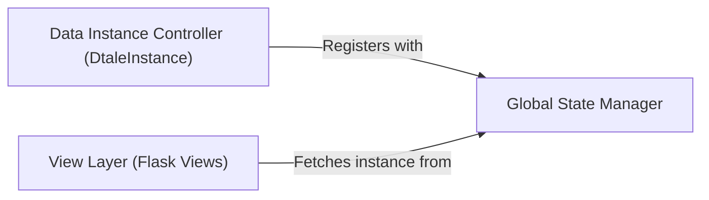

## Details

One paragraph explaining the functionality which is represented by this graph. What the main flow is and what is its purpose.

### Global State Manager
This component implements the singleton pattern to act as a central, in-memory registry for all active data instances. It is responsible for the entire lifecycle of the data, including storage, retrieval, and cleanup. Its global nature ensures that any part of the application can access any dataset if it has the correct identifier.

**Related Classes/Methods**:

- `dtale.global_state`

### Data Instance Controller (DtaleInstance)
This class acts as a wrapper or controller for a single pandas DataFrame. Each DtaleInstance object encapsulates one dataset and its associated metadata. Upon instantiation, it registers itself with the Global State Manager to make the dataset available to the rest of the application. It is the primary object that other components interact with to perform data-specific operations.

**Related Classes/Methods**:

- <a href="https://github.com/man-group/dtale/blob/master/dtale/global_state.py#L44-L145" target="_blank" rel="noopener noreferrer">`dtale.global_state.DtaleInstance` (44:145)</a>

### View Layer (Flask Views)
The View Layer consists of Flask view functions that serve as the HTTP endpoints for the frontend. These functions handle incoming web requests, which typically include a data instance ID. They use this ID to query the Global State Manager, retrieve the appropriate DtaleInstance, and then perform actions or serve data based on the request.

**Related Classes/Methods**:

- `dtale.views`

### [FAQ](https://github.com/CodeBoarding/GeneratedOnBoardings/tree/main?tab=readme-ov-file#faq)