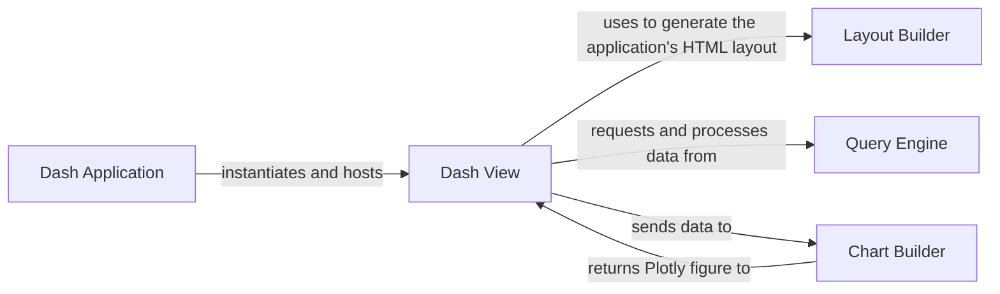

## Details

One paragraph explaining the functionality which is represented by this graph. What the main flow is and what is its purpose.

### Dash Application
This is the core container for the visualization subsystem. It represents the DtaleDash instance, which encapsulates the underlying Flask server and manages the application's lifecycle and state. It serves the initial HTML shell that hosts the entire user interface.

**Related Classes/Methods**:

- `dtale.dash_application.main`

### Dash View
The central controller and orchestrator of the subsystem. It initializes the Dash application within the Flask environment and, most critically, registers all the interactive callbacks. These callbacks connect UI events (like a dropdown selection) to backend logic, driving the entire reactive flow of the application.

**Related Classes/Methods**:

- `dtale.dash_application.views`

### Layout Builder
Responsible for generating the static HTML structure and UI controls (e.g., tabs, dropdowns, buttons) of the Dash application. It declaratively defines the visual presentation and provides the interactive elements that users interact with. These elements are the targets for the callbacks registered in the Dash View.

**Related Classes/Methods**:

- `dtale.dash_application.layout.layout`

### Chart Builder
The core rendering engine responsible for creating visualizations. It receives data and user-defined settings (e.g., chart type, axes) from the Dash View's callbacks and uses them to construct the final Plotly figure objects that are displayed on the frontend.

**Related Classes/Methods**:

- `dtale.dash_application.charts`

### Query Engine
An external dependency responsible for all data manipulation and querying. The Dash View invokes this component to filter, aggregate, or transform the underlying Pandas DataFrame based on user requests before passing the resulting data to the Chart Builder.

**Related Classes/Methods**:

- `dtale.query`

### [FAQ](https://github.com/CodeBoarding/GeneratedOnBoardings/tree/main?tab=readme-ov-file#faq)