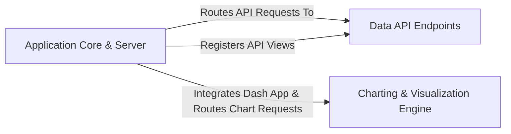

## Details

This analysis details the architecture of the `Web Server & API Layer`, which serves as the primary entry point for all client interactions. It orchestrates backend operations by handling HTTP requests, serving the frontend application, and exposing a comprehensive API.

### Application Core & Server
This is the foundational component of the D-Tale application. It uses a custom `DtaleFlask` class to initialize and configure the Flask web server. Its primary responsibilities include serving the static assets for the React-based Single Page Application (SPA), managing the application lifecycle, and acting as the central router that dispatches incoming HTTP requests to the appropriate API or charting components.

**Related Classes/Methods**:

- `dtale.app`

### Data API Endpoints
This component implements the core RESTful API for all non-visualization data operations. It defines a set of endpoints that the frontend uses to load data (e.g., from CSVs, DataFrames), retrieve dataset metadata, and trigger backend data processing and manipulation tasks. The `startup` function within this domain is a key entry point for registering new data instances with the application.

**Related Classes/Methods**:

- `dtale.views`

### Charting & Visualization Engine
A specialized and self-contained component responsible for creating, managing, and serving interactive visualizations. It is built on the Plotly Dash framework, which is tightly integrated into the main `DtaleFlask` application. This engine handles its own views, defines the layout of charts and dashboards, and manages a complex system of callbacks to handle user interactions like filtering, zooming, and selections in real-time.

**Related Classes/Methods**:

- `dtale.dash_application.views`
- `dtale.dash_application.layout`

### [FAQ](https://github.com/CodeBoarding/GeneratedOnBoardings/tree/main?tab=readme-ov-file#faq)