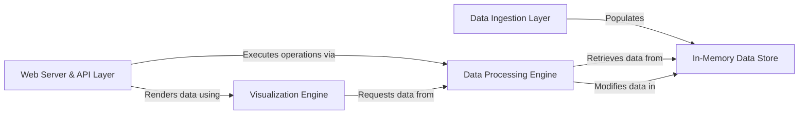

## Details

One paragraph explaining the functionality which is represented by this graph. What the main flow is and what is its purpose.

### Web Server & API Layer [[Expand]](./Web_Server_API_Layer.md)
The central entry point for all client communication. It is a Flask-based component that handles HTTP requests, serves the React frontend, and exposes a RESTful API to orchestrate all backend operations.

**Related Classes/Methods**:

- `DtaleFlask`
- `startup`

### Data Ingestion Layer [[Expand]](./Data_Ingestion_Layer.md)
Responsible for loading data from various sources (e.g., CSV, Excel, JSON) into the application. It standardizes incoming data into pandas DataFrames before handing them off to be stored.

**Related Classes/Methods**:

- `startup`

### In-Memory Data Store [[Expand]](./In_Memory_Data_Store.md)
A centralized, stateful repository that holds all active pandas DataFrames. It assigns a unique identifier to each dataset, allowing other components to retrieve and operate on them throughout the user session.

**Related Classes/Methods**:

- `dtale/global_state.py`

### Data Processing Engine [[Expand]](./Data_Processing_Engine.md)
A comprehensive suite of tools for data manipulation. It executes queries, applies filters, creates new columns, and reshapes data structures based on commands from the API layer, directly interacting with the DataFrames in the store.

**Related Classes/Methods**:

- `dtale/views.py`

### Visualization Engine [[Expand]](./Visualization_Engine.md)
Built on Dash and Plotly, this component is responsible for generating all interactive charts and visualizations. It requests data from the Data Processing Engine and transforms it into rich, interactive figures rendered on the frontend.

**Related Classes/Methods**:

- `dtale/dash_application/views.py`

### [FAQ](https://github.com/CodeBoarding/GeneratedOnBoardings/tree/main?tab=readme-ov-file#faq)