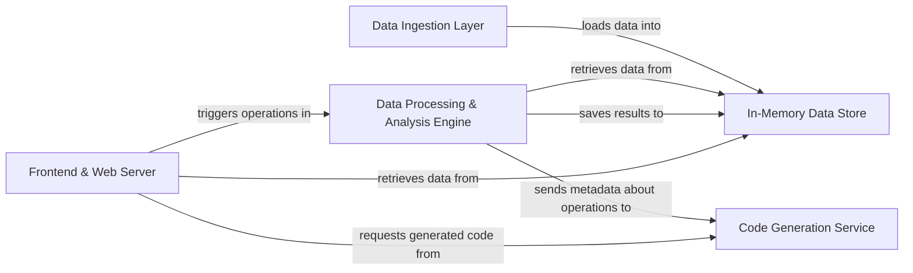

## Details

One paragraph explaining the functionality which is represented by this graph. What the main flow is and what is its purpose.

### Frontend & Web Server [[Expand]](./Frontend_Web_Server.md)
This component serves as the primary user entry point, built on Flask and Dash. It renders the web interface, including data grids and visualizations, and captures all user interactions. It acts as an orchestrator, dispatching requests to the appropriate backend services and retrieving data for display.

**Related Classes/Methods**:

- `dtale.views`
- <a href="https://github.com/man-group/dtale/blob/master/dtale/views.py#L216-L717" target="_blank" rel="noopener noreferrer">`dtale.views.DtaleData` (216:717)</a>

### Data Ingestion Layer [[Expand]](./Data_Ingestion_Layer.md)
This component is responsible for populating the application with data. It provides a set of configurable loaders to import datasets from various external sources like files (CSV, Excel) and databases.

**Related Classes/Methods**:

- <a href="https://github.com/man-group/dtale/blob/master/dtale/views.py#L909-L1300" target="_blank" rel="noopener noreferrer">`dtale.views.startup` (909:1300)</a>
- `dtale.datasets`

### In-Memory Data Store [[Expand]](./In_Memory_Data_Store.md)
This component is the heart of the application, acting as a centralized, in-memory repository for all active datasets. It holds the state of the pandas DataFrames, ensuring that all other components operate on a consistent and up-to-date version of the data.

**Related Classes/Methods**:

- `dtale.global_state.get_data`
- `dtale.global_state.set_data`
- <a href="https://github.com/man-group/dtale/blob/master/dtale/views.py#L216-L717" target="_blank" rel="noopener noreferrer">`dtale.views.DtaleData` (216:717)</a>

### Data Processing & Analysis Engine [[Expand]](./Data_Processing_Analysis_Engine.md)
This is the core logic engine of D-Tale. It executes a wide range of data manipulation and analysis tasks based on commands received from the frontend. It interacts heavily with the In-Memory Data Store to fetch data and persist results.

**Related Classes/Methods**:

- `dtale.query`
- `dtale.describe`
- `dtale.correlations`
- `dtale.column_analysis`

### Code Generation Service [[Expand]](./Code_Generation_Service.md)
This component provides reproducibility by translating user actions into executable Python code. It observes operations performed by the Data Processing & Analysis Engine and maintains a history that can be exported on demand.

**Related Classes/Methods**:

- <a href="https://github.com/man-group/dtale/blob/master/dtale/code_export.py#L44-L129" target="_blank" rel="noopener noreferrer">`dtale.code_export.build_code_export` (44:129)</a>

### [FAQ](https://github.com/CodeBoarding/GeneratedOnBoardings/tree/main?tab=readme-ov-file#faq)