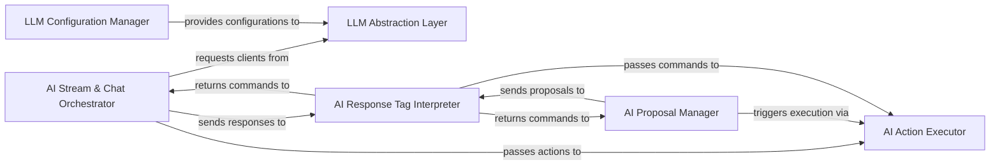

## Details

The AI Interaction & Code Generation Engine subsystem is the core of Dyad's intelligence, responsible for managing the lifecycle of AI interactions, from sending prompts to executing AI-generated code and actions. It embodies the "AI Model Adapters/Connectors" and "Code Generation/Scaffolding Engine" patterns, with a strong emphasis on modularity and a pipeline/workflow approach for processing AI responses.

### AI Stream & Chat Orchestrator
Manages the real-time streaming of AI responses, including preparing messages with attachments, processing incoming data chunks, and orchestrating the interaction with the underlying AI model client. It acts as the primary interface for continuous AI dialogue.

**Related Classes/Methods**:

- <a href="https://github.com/dyad-sh/dyad/blob/main/src/ipc/handlers/chat_stream_handlers.ts" target="_blank" rel="noopener noreferrer">`AI Stream & Chat Orchestrator`</a>

### AI Proposal Manager
Handles AI-generated code proposals, including the logic for approving proposals and generating new ones by analyzing AI responses. It plays a critical role in the iterative refinement of AI-generated code.

**Related Classes/Methods**:

- <a href="https://github.com/dyad-sh/dyad/blob/main/src/ipc/handlers/proposal_handlers.ts" target="_blank" rel="noopener noreferrer">`AI Proposal Manager`</a>

### AI Action Executor
The core execution engine for AI-generated actions. It interprets Dyad-specific tags (e.g., <DyadWrite>, <DyadRename>, <DyadDelete>) and translates them into concrete operations like file system modifications, Git commits, and interactions with external services.

**Related Classes/Methods**:

- <a href="https://github.com/dyad-sh/dyad/blob/main/src/ipc/processors/response_processor.ts" target="_blank" rel="noopener noreferrer">`AI Action Executor`</a>

### LLM Abstraction Layer
Provides a unified abstraction layer for interacting with various AI language models, handling the creation and configuration of chat models. It serves as a factory for AI model clients, decoupling the core logic from specific LLM providers.

**Related Classes/Methods**:

- <a href="https://github.com/dyad-sh/dyad/blob/main/src/ipc/utils/llm_engine_provider.ts" target="_blank" rel="noopener noreferrer">`LLM Abstraction Layer`</a>

### LLM Configuration Manager
Manages the registration and retrieval of available language model providers and their respective models. It acts as an IPC handler, allowing the UI to configure and select different AI models.

**Related Classes/Methods**:

- <a href="https://github.com/dyad-sh/dyad/blob/main/src/ipc/handlers/language_model_handlers.ts" target="_blank" rel="noopener noreferrer">`LLM Configuration Manager`</a>

### AI Response Tag Interpreter
Extracts and interprets Dyad-specific action tags embedded within AI responses. This component is crucial for translating unstructured AI text into structured, executable commands for the application.

**Related Classes/Methods**:

- <a href="https://github.com/dyad-sh/dyad/blob/main/src/ipc/utils/dyad_tag_parser.ts" target="_blank" rel="noopener noreferrer">`AI Response Tag Interpreter`</a>

### [FAQ](https://github.com/CodeBoarding/GeneratedOnBoardings/tree/main?tab=readme-ov-file#faq)