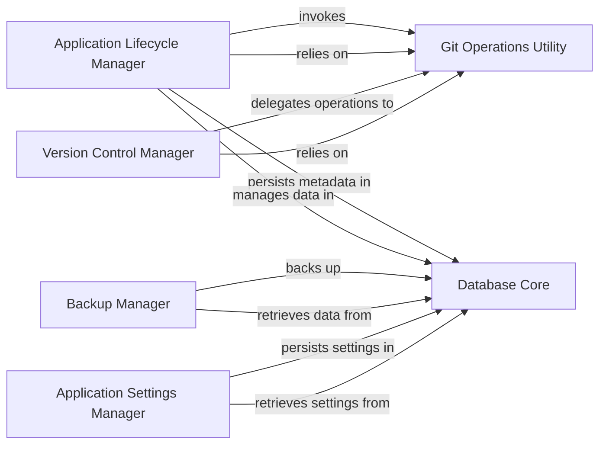

## Details

The `dyad` application's core architecture is structured around managing project lifecycles, version control, and persistent data. The `Application Lifecycle Manager` serves as the central orchestrator, handling project creation, loading, and management, relying on the `Database Core` for metadata persistence and the `Git Operations Utility` for version control actions. The `Version Control Manager` provides an abstract interface for Git operations, delegating the execution of low-level commands to the `Git Operations Utility`. All persistent application data, including project metadata and global settings, is managed by the `Database Core`, which is utilized by the `Application Settings Manager` for user preferences and by the `Backup Manager` for data recovery operations. This design ensures a clear separation of concerns, with dedicated components for application lifecycle, version control, data persistence, and backup functionalities.

### Application Lifecycle Manager
Orchestrates project-level operations such as creation, loading, saving, renaming, deletion, and environment variable management. It acts as the primary interface for project-related actions.

**Related Classes/Methods**:

- <a href="https://github.com/dyad-sh/dyad/blob/main/src/ipc/handlers/app_handlers.ts" target="_blank" rel="noopener noreferrer">`src/ipc/handlers/app_handlers.ts`</a>

### Version Control Manager
Manages the versioning aspects of projects, providing an abstraction layer over underlying Git functionalities.

**Related Classes/Methods**:

- <a href="https://github.com/dyad-sh/dyad/blob/main/src/ipc/handlers/version_handlers.ts" target="_blank" rel="noopener noreferrer">`src/ipc/handlers/version_handlers.ts`</a>

### Git Operations Utility
Provides a set of low-level utility functions for executing Git commands, acting as the direct interface to the Git system.

**Related Classes/Methods**:

- <a href="https://github.com/dyad-sh/dyad/blob/main/src/ipc/utils/git_utils.ts" target="_blank" rel="noopener noreferrer">`src/ipc/utils/git_utils.ts`</a>

### Database Core
Initializes and provides access to the application's SQLite database, serving as the central repository for storing project metadata and other persistent application data.

**Related Classes/Methods**:

- <a href="https://github.com/dyad-sh/dyad/blob/main/src/db/index.ts" target="_blank" rel="noopener noreferrer">`src/db/index.ts`</a>

### Application Settings Manager
Handles the persistence, reading, writing, encryption, and decryption of global application settings, ensuring user preferences are maintained across sessions.

**Related Classes/Methods**:

- <a href="https://github.com/dyad-sh/dyad/blob/main/src/main/settings.ts" target="_blank" rel="noopener noreferrer">`src/main/settings.ts`</a>

### Backup Manager
Manages the creation, cleanup, and size calculation of application backups, providing critical data recovery capabilities.

**Related Classes/Methods**:

- <a href="https://github.com/dyad-sh/dyad/blob/main/src/backup_manager.ts" target="_blank" rel="noopener noreferrer">`src/backup_manager.ts`</a>

### [FAQ](https://github.com/CodeBoarding/GeneratedOnBoardings/tree/main?tab=readme-ov-file#faq)