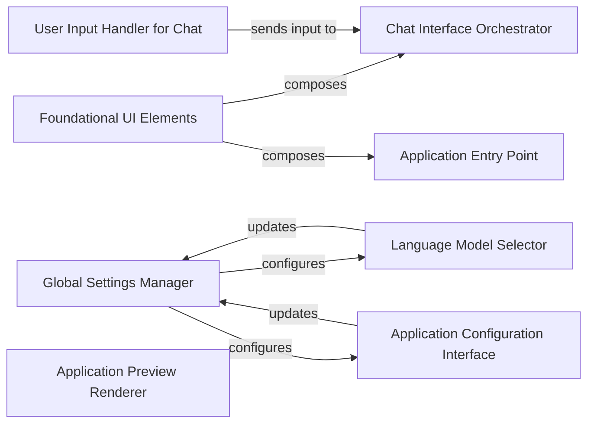

## Details

The Dyad application's architecture is centered around a modular UI and a centralized settings management system. `Foundational UI Elements` provide the visual consistency across the application, forming the basis for key interaction points like the `Application Entry Point`, `Chat Interface Orchestrator`, and `Application Configuration Interface`. The `Global Settings Manager` acts as the single source of truth for application and user preferences, dynamically configuring components such as the `Language Model Selector` and receiving updates from configuration interfaces. User interaction with AI models is facilitated by the `Chat Interface Orchestrator` and its `User Input Handler for Chat`. The `Application Preview Renderer` offers immediate visual feedback, completing the core loop of the application builder.

### Foundational UI Elements
Provides a consistent visual language and reusable building blocks (e.g., Button, Dialog, Input) that are composed by nearly all other UI components within the application, ensuring a cohesive and polished desktop application experience.

**Related Classes/Methods**:

- <a href="https://github.com/dyad-sh/dyad/blob/main/src/components/ui/" target="_blank" rel="noopener noreferrer">`ui_components`</a>

### Global Settings Manager
Manages and provides reactive access to user and application settings, including configurations for AI models and integrations. It acts as a central state management hub for application preferences.

**Related Classes/Methods**:

- <a href="https://github.com/dyad-sh/dyad/blob/main/src/hooks/useSettings.ts#L22-L92" target="_blank" rel="noopener noreferrer">`useSettings`:22-92</a>

### Chat Interface Orchestrator
Integrates various chat-related sub-components and manages the display and interaction flow for AI-driven chat, which is a core feature for interacting with AI models in the application builder.

**Related Classes/Methods**:

- <a href="https://github.com/dyad-sh/dyad/blob/main/src/components/ChatPanel.tsx#L18-L123" target="_blank" rel="noopener noreferrer">`ChatPanel`:18-123</a>

### User Input Handler for Chat
Captures and processes user input, attachments, and action proposals specifically for the chat interface, directly facilitating user interaction with the AI models.

**Related Classes/Methods**:

- <a href="https://github.com/dyad-sh/dyad/blob/main/src/components/chat/LexicalChatInput.tsx#L233-L366" target="_blank" rel="noopener noreferrer">`ChatInput`:233-366</a>

### Language Model Selector
Provides the user interface and logic for selecting and configuring different language models, a key feature for an AI application builder allowing users to choose their AI backend.

**Related Classes/Methods**:

- <a href="https://github.com/dyad-sh/dyad/blob/main/src/components/ModelPicker.tsx#L28-L143" target="_blank" rel="noopener noreferrer">`ModelPicker`:28-143</a>

### Application Preview Renderer
Displays and manages the live preview of the application being built, offering immediate visual feedback to the user during the development process.

**Related Classes/Methods**:

- <a href="https://github.com/dyad-sh/dyad/blob/main/src/components/preview_panel/PreviewPanel.tsx#L51-L124" target="_blank" rel="noopener noreferrer">`PreviewPanel`:51-124</a>

### Application Entry Point
Serves as the initial screen for application creation and loading, providing the starting point for the user's interaction with the application builder.

**Related Classes/Methods**:

- <a href="https://github.com/dyad-sh/dyad/blob/main/src/pages/home.tsx#L41-L213" target="_blank" rel="noopener noreferrer">`HomePage`:41-213</a>

### Application Configuration Interface
Provides the user interface for managing all application-wide settings, including integrations, preferences, and advanced configurations, crucial for customizing the AI application builder environment.

**Related Classes/Methods**:

- <a href="https://github.com/dyad-sh/dyad/blob/main/src/components/settings/ProviderSettingsPage.tsx#L24-L236" target="_blank" rel="noopener noreferrer">`SettingsPage`:24-236</a>

### [FAQ](https://github.com/CodeBoarding/GeneratedOnBoardings/tree/main?tab=readme-ov-file#faq)