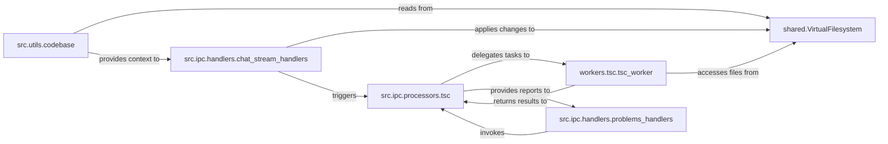

## Details

The `Codebase Analysis & Virtual File System` subsystem is central to how the application understands and interacts with the user's project. It provides an in-memory representation of the codebase and performs static analysis to identify issues, crucial for an AI Application Builder.

### shared.VirtualFilesystem
This is the foundational component, acting as the single source of truth for the current codebase state. It provides core CRUD operations and change tracking for files in memory, enabling the AI to propose and track modifications without directly altering the disk.

**Related Classes/Methods**:

- <a href="https://github.com/dyad-sh/dyad/blob/main/shared/VirtualFilesystem.ts" target="_blank" rel="noopener noreferrer">`shared.VirtualFilesystem`</a>

### src.utils.codebase
Provides a unified abstraction layer for accessing and formatting codebase information, integrating both physical and virtual file system states. It ensures a consistent view of the codebase for AI models and other internal components.

**Related Classes/Methods**:

- <a href="https://github.com/dyad-sh/dyad/blob/main/src/utils/codebase.ts" target="_blank" rel="noopener noreferrer">`src.utils.codebase`</a>

### src.ipc.processors.tsc
Manages the high-level logic for TypeScript problem analysis. It orchestrates the process of generating diagnostic reports based on the current state of the codebase, coordinating with the dedicated worker for heavy computation.

**Related Classes/Methods**:

- <a href="https://github.com/dyad-sh/dyad/blob/main/src/ipc/processors/tsc.ts" target="_blank" rel="noopener noreferrer">`src.ipc.processors.tsc`</a>

### workers.tsc.tsc_worker
Executes resource-intensive TypeScript compilation and problem detection in a separate worker process. This offloads heavy computation from the main application thread, ensuring UI responsiveness and a smooth user experience.

**Related Classes/Methods**:

- <a href="https://github.com/dyad-sh/dyad/blob/main/workers/tsc/tsc_worker.ts" target="_blank" rel="noopener noreferrer">`workers.tsc.tsc_worker`</a>

### src.ipc.handlers.problems_handlers
Handles Inter-Process Communication (IPC) requests from the frontend to retrieve TypeScript problem reports. It acts as an API endpoint, providing diagnostic information to the UI or other client-side components.

**Related Classes/Methods**:

- <a href="https://github.com/dyad-sh/dyad/blob/main/src/ipc/handlers/problems_handlers.ts" target="_blank" rel="noopener noreferrer">`src.ipc.handlers.problems_handlers`</a>

### src.ipc.handlers.chat_stream_handlers
Manages the streaming of AI chat responses. Critically, it applies AI-proposed file modifications to the VirtualFilesystem and subsequently triggers a re-analysis of the codebase for problems, closing the loop on AI-driven code changes and their validation.

**Related Classes/Methods**:

- <a href="https://github.com/dyad-sh/dyad/blob/main/src/ipc/handlers/chat_stream_handlers.ts" target="_blank" rel="noopener noreferrer">`src.ipc.handlers.chat_stream_handlers`</a>

### [FAQ](https://github.com/CodeBoarding/GeneratedOnBoardings/tree/main?tab=readme-ov-file#faq)