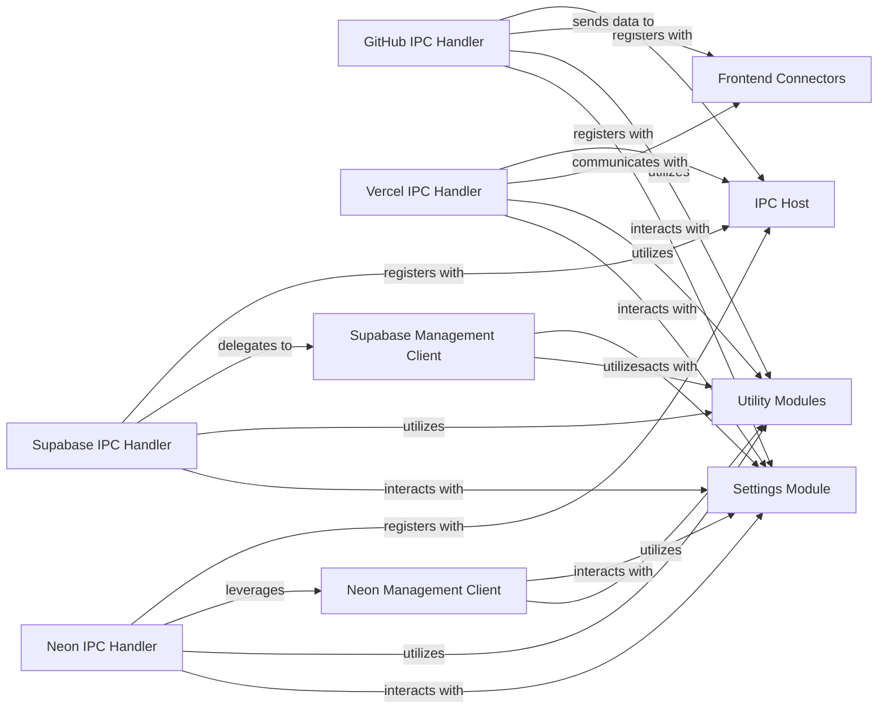

## Details

One paragraph explaining the functionality which is represented by this graph. What the main flow is and what is its purpose.

### GitHub IPC Handler
Manages all Inter-Process Communication (IPC) related to GitHub, including repository connection, creation, listing, branch retrieval, synchronization, and OAuth device flow. It acts as the bridge between the frontend and GitHub-specific operations.

**Related Classes/Methods**:

- <a href="https://github.com/dyad-sh/dyad/blob/main/src/ipc/handlers/github_handlers.ts" target="_blank" rel="noopener noreferrer">`src/ipc/handlers/github_handlers.ts`</a>

### Vercel IPC Handler
Manages all IPC communications related to Vercel, covering project connections, creation, listing, deployment, and access token validation.

**Related Classes/Methods**:

- <a href="https://github.com/dyad-sh/dyad/blob/main/src/ipc/handlers/vercel_handlers.ts" target="_blank" rel="noopener noreferrer">`src/ipc/handlers/vercel_handlers.ts`</a>

### Supabase IPC Handler
Handles Supabase project connections and the OAuth return process. It delegates core API interactions to the Supabase Management Client.

**Related Classes/Methods**:

- <a href="https://github.com/dyad-sh/dyad/blob/main/src/ipc/handlers/supabase_handlers.ts" target="_blank" rel="noopener noreferrer">`src/ipc/handlers/supabase_handlers.ts`</a>

### Neon IPC Handler
Manages Neon project connections, often coordinating with the Neon Management Client for underlying API operations.

**Related Classes/Methods**:

- <a href="https://github.com/dyad-sh/dyad/blob/main/src/ipc/handlers/neon_handlers.ts" target="_blank" rel="noopener noreferrer">`src/ipc/handlers/neon_handlers.ts`</a>

### Supabase Management Client
Provides a low-level client for direct interaction with the Supabase Management API, handling function deployment/deletion, SQL execution, and authentication token management.

**Related Classes/Methods**:

- <a href="https://github.com/dyad-sh/dyad/blob/main/src/supabase_admin/supabase_management_client.ts" target="_blank" rel="noopener noreferrer">`src/supabase_admin/supabase_management_client.ts`</a>

### Neon Management Client
Offers a client for interacting with the Neon API, including obtaining client instances, retrieving organization IDs, and refreshing tokens.

**Related Classes/Methods**:

- <a href="https://github.com/dyad-sh/dyad/blob/main/src/neon_admin/neon_management_client.ts" target="_blank" rel="noopener noreferrer">`src/neon_admin/neon_management_client.ts`</a>

### IPC Host
Manages Inter-Process Communication by listening for and routing requests.

**Related Classes/Methods**:

- <a href="https://github.com/dyad-sh/dyad/blob/main/src/ipc/ipc_host.ts" target="_blank" rel="noopener noreferrer">`src/ipc/ipc_host.ts`</a>

### Frontend Connectors
Handles communication with the frontend, sending operation results and data.

**Related Classes/Methods**:

- <a href="https://github.com/dyad-sh/dyad/blob/main/src/components/GitHubConnector.tsx" target="_blank" rel="noopener noreferrer">`src/components/GitHubConnector.tsx`</a>

### Utility Modules
Provides common functionalities such as error handling and concurrency.

**Related Classes/Methods**:

- <a href="https://github.com/dyad-sh/dyad/blob/main/src/utils/codebase.ts" target="_blank" rel="noopener noreferrer">`src/utils/codebase.ts`</a>

### Settings Module
Manages persistent configuration and token management.

**Related Classes/Methods**:

- <a href="https://github.com/dyad-sh/dyad/blob/main/src/main/settings.ts" target="_blank" rel="noopener noreferrer">`src/main/settings.ts`</a>

### [FAQ](https://github.com/CodeBoarding/GeneratedOnBoardings/tree/main?tab=readme-ov-file#faq)