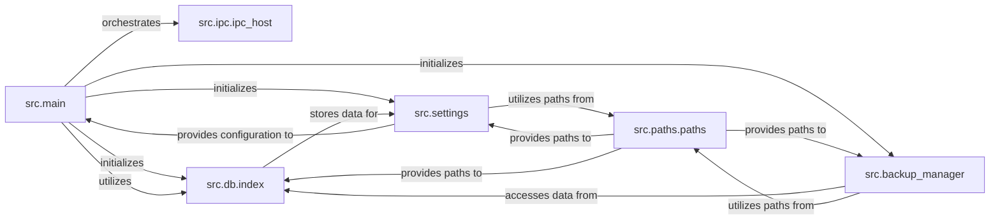

## Details

The Dyad application's core architecture is designed around a central orchestrator (`src.main`) that manages the application lifecycle and integrates various backend services. Inter-process communication (`src.ipc.ipc_host`) facilitates secure interaction between the main process and the user interface. Data persistence is handled by `src.db.index`, which provides an interface to the SQLite database. Application configurations are managed by `src.settings`, ensuring consistent loading and saving of user preferences. Finally, `src.backup_manager` is responsible for data integrity through backup and recovery operations, while `src.paths.paths` provides essential file system path management for various components.

### src.main
The central entry point and orchestrator for the entire application. It initializes the Electron environment, manages window lifecycles, and sets up all core backend services.

**Related Classes/Methods**:

- <a href="https://github.com/dyad-sh/dyad/blob/main/src/main" target="_blank" rel="noopener noreferrer">`src.main`</a>

### src.ipc.ipc_host
Manages inter-process communication (IPC) between the main process and renderer processes (UI). It exposes backend functionalities and services securely to the frontend.

**Related Classes/Methods**:

- <a href="https://github.com/dyad-sh/dyad/blob/main/src/ipc/ipc_host.ts#L34-L68" target="_blank" rel="noopener noreferrer">`src.ipc.ipc_host`:34-68</a>

### src.db.index
Responsible for initializing and providing access to the application's SQLite database. It abstracts database operations, ensuring data persistence for the application.

**Related Classes/Methods**:

- <a href="https://github.com/dyad-sh/dyad/blob/main/src/db/index.ts" target="_blank" rel="noopener noreferrer">`src.db.index`</a>

### src.settings
Handles the loading, saving, and encryption of application settings. It provides a centralized mechanism for managing user preferences and configuration.

**Related Classes/Methods**:

- <a href="https://github.com/dyad-sh/dyad/blob/main/src/settings.ts" target="_blank" rel="noopener noreferrer">`src.settings`</a>

### src.backup_manager
Oversees data backup and recovery operations, ensuring the integrity and availability of critical application data.

**Related Classes/Methods**:

- <a href="https://github.com/dyad-sh/dyad/blob/main/src/backup_manager.ts" target="_blank" rel="noopener noreferrer">`src.backup_manager`</a>

### src.paths.paths
Provides standardized and platform-agnostic file system paths for various application resources, supporting components like the database and settings manager.

**Related Classes/Methods**:

- <a href="https://github.com/dyad-sh/dyad/blob/main/src/paths/paths.ts" target="_blank" rel="noopener noreferrer">`src.paths.paths`</a>

### [FAQ](https://github.com/CodeBoarding/GeneratedOnBoardings/tree/main?tab=readme-ov-file#faq)