```mermaid
graph LR
    Client_UI_State_Management["Client UI & State Management"]
    IPC_Communication_Layer["IPC Communication Layer"]
    Main_Application_Process["Main Application Process"]
    Application_Project_Core_Services["Application & Project Core Services"]
    AI_Interaction_Code_Generation_Engine["AI Interaction & Code Generation Engine"]
    Codebase_Analysis_Virtual_File_System["Codebase Analysis & Virtual File System"]
    External_Integrations_Manager["External Integrations Manager"]
    Client_UI_State_Management -- "sends requests and data to" --> IPC_Communication_Layer
    IPC_Communication_Layer -- "forwards requests to" --> Main_Application_Process
    Main_Application_Process -- "dispatches requests to" --> Application_Project_Core_Services
    Main_Application_Process -- "dispatches requests to" --> AI_Interaction_Code_Generation_Engine
    Main_Application_Process -- "dispatches requests to" --> Codebase_Analysis_Virtual_File_System
    Main_Application_Process -- "dispatches requests to" --> External_Integrations_Manager
    AI_Interaction_Code_Generation_Engine -- "requests context and applies changes to" --> Codebase_Analysis_Virtual_File_System
    AI_Interaction_Code_Generation_Engine -- "triggers actions in" --> Application_Project_Core_Services
    AI_Interaction_Code_Generation_Engine -- "initiates actions through" --> External_Integrations_Manager
    Application_Project_Core_Services -- "interacts with" --> Codebase_Analysis_Virtual_File_System
    Application_Project_Core_Services -- "triggers synchronization with" --> External_Integrations_Manager
    click Client_UI_State_Management href "https://github.com/CodeBoarding/GeneratedOnBoardings/blob/main/dyad/Client_UI_State_Management.md" "Details"
    click Main_Application_Process href "https://github.com/CodeBoarding/GeneratedOnBoardings/blob/main/dyad/Main_Application_Process.md" "Details"
    click Application_Project_Core_Services href "https://github.com/CodeBoarding/GeneratedOnBoardings/blob/main/dyad/Application_Project_Core_Services.md" "Details"
    click AI_Interaction_Code_Generation_Engine href "https://github.com/CodeBoarding/GeneratedOnBoardings/blob/main/dyad/AI_Interaction_Code_Generation_Engine.md" "Details"
    click Codebase_Analysis_Virtual_File_System href "https://github.com/CodeBoarding/GeneratedOnBoardings/blob/main/dyad/Codebase_Analysis_Virtual_File_System.md" "Details"
    click External_Integrations_Manager href "https://github.com/CodeBoarding/GeneratedOnBoardings/blob/main/dyad/External_Integrations_Manager.md" "Details"
```

## Details

Dyad's architecture is structured around a clear separation of concerns, facilitating a robust and scalable application. The Client UI & State Management component serves as the primary user interface, handling all user interactions and maintaining the application's frontend state. This component communicates exclusively with the IPC Communication Layer, which acts as a secure and standardized bridge to the backend.

The Main Application Process is the central orchestrator on the backend, receiving all requests from the IPC Communication Layer. It dispatches these requests to specialized core services: Application & Project Core Services for managing project lifecycle and settings, AI Interaction & Code Generation Engine for all AI-related functionalities, Codebase Analysis & Virtual File System for in-depth code analysis and managing proposed file changes, and External Integrations Manager for interacting with third-party cloud services.

The AI Interaction & Code Generation Engine is a pivotal component, relying on the Codebase Analysis & Virtual File System for contextual information and applying proposed changes. It can also trigger actions within the Application & Project Core Services (e.g., saving generated code) and initiate deployments or other external operations via the External Integrations Manager. The Application & Project Core Services also interacts with the Codebase Analysis & Virtual File System for project-related file operations and can synchronize with the External Integrations Manager for version control or deployment tasks.

This architecture ensures a clear data flow, with the Main Application Process acting as a central hub, directing requests to the appropriate backend services, and enabling complex interactions between the AI, codebase management, and external platforms.

### Client UI & State Management [[Expand]](./Client_UI_State_Management.md)
The user-facing application layer, responsible for rendering all visual elements, handling user input, and managing reactive frontend state. It abstracts direct IPC calls for UI components.

**Related Classes/Methods**:

- <a href="https://github.com/dyad-sh/dyad/blob/main/src/app/" target="_blank" rel="noopener noreferrer">`src/app/`</a>
- <a href="https://github.com/dyad-sh/dyad/blob/main/src/components/" target="_blank" rel="noopener noreferrer">`src/components/`</a>
- <a href="https://github.com/dyad-sh/dyad/blob/main/src/pages/" target="_blank" rel="noopener noreferrer">`src/pages/`</a>
- <a href="https://github.com/dyad-sh/dyad/blob/main/src/hooks/" target="_blank" rel="noopener noreferrer">`src/hooks/`</a>
- <a href="https://github.com/dyad-sh/dyad/blob/main/src/atoms/" target="_blank" rel="noopener noreferrer">`src/atoms/`</a>

### IPC Communication Layer
The essential bridge facilitating communication between the frontend (renderer process) and the backend (main Electron process). It standardizes message passing.

**Related Classes/Methods**:

- <a href="https://github.com/dyad-sh/dyad/blob/main/src/ipc/ipc_client.ts" target="_blank" rel="noopener noreferrer">`src/ipc/ipc_client.ts`</a>
- <a href="https://github.com/dyad-sh/dyad/blob/main/src/ipc/ipc_host.ts" target="_blank" rel="noopener noreferrer">`src/ipc/ipc_host.ts`</a>

### Main Application Process [[Expand]](./Main_Application_Process.md)
The core Electron main process, responsible for initializing the application, managing windows, and hosting all backend IPC handlers. It acts as the central orchestrator for backend services.

**Related Classes/Methods**:

- <a href="https://github.com/dyad-sh/dyad/blob/main/src/main.ts" target="_blank" rel="noopener noreferrer">`src/main.ts`</a>

### Application & Project Core Services [[Expand]](./Application_Project_Core_Services.md)
Manages the lifecycle and persistence of user application projects, including creation, loading, saving, renaming, deleting, environment variable management, and version control. It also handles local application settings and backups.

**Related Classes/Methods**:

- <a href="https://github.com/dyad-sh/dyad/blob/main/src/ipc/handlers/app_handlers.ts" target="_blank" rel="noopener noreferrer">`src/ipc/handlers/app_handlers.ts`</a>
- <a href="https://github.com/dyad-sh/dyad/blob/main/src/ipc/handlers/version_handlers.ts" target="_blank" rel="noopener noreferrer">`src/ipc/handlers/version_handlers.ts`</a>
- <a href="https://github.com/dyad-sh/dyad/blob/main/src/ipc/utils/git_utils.ts" target="_blank" rel="noopener noreferrer">`src/ipc/utils/git_utils.ts`</a>
- <a href="https://github.com/dyad-sh/dyad/blob/main/src/db/index.ts" target="_blank" rel="noopener noreferrer">`src/db/index.ts`</a>
- <a href="https://github.com/dyad-sh/dyad/blob/main/src/main/settings.ts" target="_blank" rel="noopener noreferrer">`src/main/settings.ts`</a>
- <a href="https://github.com/dyad-sh/dyad/blob/main/src/backup_manager.ts" target="_blank" rel="noopener noreferrer">`src/backup_manager.ts`</a>

### AI Interaction & Code Generation Engine [[Expand]](./AI_Interaction_Code_Generation_Engine.md)
Manages the core AI interaction, including streaming responses, processing AI-generated actions (code writes, renames, deletes, dependencies, SQL), and handling chat context. It also manages the configuration and interaction with various AI language models and their providers.

**Related Classes/Methods**:

- <a href="https://github.com/dyad-sh/dyad/blob/main/src/ipc/handlers/chat_stream_handlers.ts" target="_blank" rel="noopener noreferrer">`src/ipc/handlers/chat_stream_handlers.ts`</a>
- <a href="https://github.com/dyad-sh/dyad/blob/main/src/ipc/handlers/proposal_handlers.ts" target="_blank" rel="noopener noreferrer">`src/ipc/handlers/proposal_handlers.ts`</a>
- <a href="https://github.com/dyad-sh/dyad/blob/main/src/ipc/processors/response_processor.ts" target="_blank" rel="noopener noreferrer">`src/ipc/processors/response_processor.ts`</a>
- <a href="https://github.com/dyad-sh/dyad/blob/main/src/ipc/utils/llm_engine_provider.ts" target="_blank" rel="noopener noreferrer">`src/ipc/utils/llm_engine_provider.ts`</a>
- <a href="https://github.com/dyad-sh/dyad/blob/main/src/ipc/handlers/language_model_handlers.ts" target="_blank" rel="noopener noreferrer">`src/ipc/handlers/language_model_handlers.ts`</a>

### Codebase Analysis & Virtual File System [[Expand]](./Codebase_Analysis_Virtual_File_System.md)
Analyzes the application codebase for structural issues and problems (e.g., TypeScript errors) and provides an in-memory representation of the application's file system. This virtual file system is used by the AI for proposing and tracking file modifications without directly altering the disk until approved.

**Related Classes/Methods**:

- <a href="https://github.com/dyad-sh/dyad/blob/main/src/ipc/handlers/problems_handlers.ts" target="_blank" rel="noopener noreferrer">`src/ipc/handlers/problems_handlers.ts`</a>
- <a href="https://github.com/dyad-sh/dyad/blob/main/src/ipc/processors/tsc.ts" target="_blank" rel="noopener noreferrer">`src.ipc.processors.tsc.ts`</a>
- <a href="https://github.com/dyad-sh/dyad/blob/main/src/utils/codebase.ts" target="_blank" rel="noopener noreferrer">`src/utils/codebase.ts`</a>
- <a href="https://github.com/dyad-sh/dyad/blob/main/workers/tsc/tsc_worker.ts" target="_blank" rel="noopener noreferrer">`workers.tsc.tsc_worker.ts`</a>
- <a href="https://github.com/dyad-sh/dyad/blob/main/shared/VirtualFilesystem.ts" target="_blank" rel="noopener noreferrer">`shared/VirtualFilesystem.ts`</a>

### External Integrations Manager [[Expand]](./External_Integrations_Manager.md)
Handles integration with various external cloud services for repository management, deployment, and database services (e.g., GitHub, Vercel, Supabase, Neon).

**Related Classes/Methods**:

- <a href="https://github.com/dyad-sh/dyad/blob/main/src/ipc/handlers/github_handlers.ts" target="_blank" rel="noopener noreferrer">`src/ipc/handlers/github_handlers.ts`</a>
- <a href="https://github.com/dyad-sh/dyad/blob/main/src/ipc/handlers/vercel_handlers.ts" target="_blank" rel="noopener noreferrer">`src/ipc/handlers/vercel_handlers.ts`</a>
- <a href="https://github.com/dyad-sh/dyad/blob/main/src/ipc/handlers/supabase_handlers.ts" target="_blank" rel="noopener noreferrer">`src/ipc/handlers/supabase_handlers.ts`</a>
- <a href="https://github.com/dyad-sh/dyad/blob/main/src/supabase_admin/supabase_management_client.ts" target="_blank" rel="noopener noreferrer">`src/supabase_admin/supabase_management_client.ts`</a>
- <a href="https://github.com/dyad-sh/dyad/blob/main/src/ipc/handlers/neon_handlers.ts" target="_blank" rel="noopener noreferrer">`src/ipc/handlers/neon_handlers.ts`</a>
- <a href="https://github.com/dyad-sh/dyad/blob/main/src/neon_admin/neon_management_client.ts" target="_blank" rel="noopener noreferrer">`src/neon_admin/neon_management_client.ts`</a>

### [FAQ](https://github.com/CodeBoarding/GeneratedOnBoardings/tree/main?tab=readme-ov-file#faq)