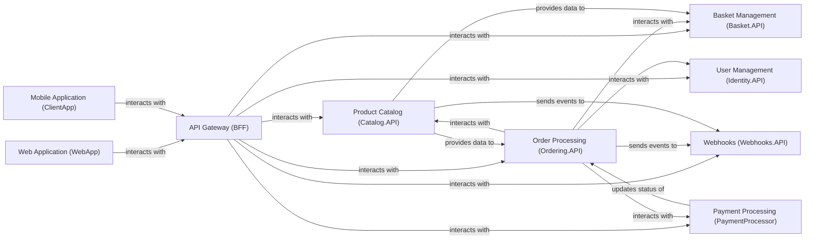

## Component Details

The API Gateway (BFF) component serves as a crucial aggregation layer and API gateway, specifically tailored for frontend applications. Its primary purpose is to simplify client-side interactions by consolidating requests to various backend microservices and transforming data as needed, thereby reducing complexity for mobile and web clients.

### API Gateway (BFF)
A Backend for Frontend (BFF) service that acts as an aggregation layer and API gateway. It simplifies interactions for client applications by consolidating requests to various backend microservices and transforming data as needed.

**Related Classes/Methods**: _None_

### Product Catalog (Catalog.API)
Manages product information, including details, brands, and types. It provides APIs for retrieving product listings and individual product details.

**Related Classes/Methods**: _None_

### User Management (Identity.API)
Handles user authentication, authorization, and user profile management. It provides secure identity services for the application.

**Related Classes/Methods**: _None_

### Order Processing (Ordering.API)
Manages the lifecycle of customer orders, from creation to fulfillment, including order validation, status updates, and integration with payment and inventory systems.

**Related Classes/Methods**: _None_

### Basket Management (Basket.API)
Manages shopping cart functionalities, allowing users to add, remove, and update items in their basket before checkout.

**Related Classes/Methods**: _None_

### Payment Processing (PaymentProcessor)
Handles payment-related operations, processing transactions and interacting with external payment gateways.

**Related Classes/Methods**: _None_

### Webhooks (Webhooks.API)
Manages webhook subscriptions and dispatches events to registered external services, enabling real-time notifications for various application events.

**Related Classes/Methods**: _None_

### Web Application (WebApp)
The primary web-based user interface for the eShop application, providing a rich interactive experience for browsing products, managing baskets, and placing orders.

**Related Classes/Methods**: _None_

### Mobile Application (ClientApp)
The mobile client application for eShop, providing a native mobile experience for users to interact with the e-commerce platform.

**Related Classes/Methods**: _None_

### [FAQ](https://github.com/CodeBoarding/GeneratedOnBoardings/tree/main?tab=readme-ov-file#faq)