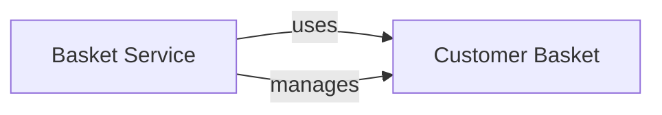

## Component Details

This analysis describes the core components of the `Basket Service` subsystem, namely `Basket Service` and `Customer Basket`, and their interactions. The `Basket Service` is the active part, encapsulating business rules and operations, while `Customer Basket` is the passive data structure. Together, they enable the shopping basket functionality.

### Basket Service
Manages user shopping baskets, allowing users to add, remove, and update items in their basket before proceeding to checkout. It is also responsible for persisting basket data, typically in a fast-access store like Redis. This component acts as the primary interface for all basket-related operations.

**Related Classes/Methods**:

- `src/Basket.API/Grpc/BasketService.cs` (1:1)

### Customer Basket
Represents the data structure of a customer's shopping basket. It holds the collection of items (e.g., product IDs, quantities, prices) that a customer intends to purchase. This component is a data model used by the `Basket Service`.

**Related Classes/Methods**:

- `src/Basket.API/Model/CustomerBasket.cs` (1:1)

### [FAQ](https://github.com/CodeBoarding/GeneratedOnBoardings/tree/main?tab=readme-ov-file#faq)