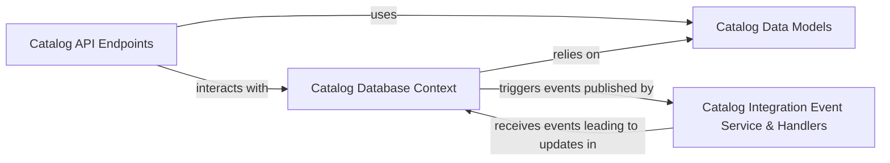

## Component Details

The Catalog Service is a core component responsible for managing all product-related information within the eShop application. It provides a comprehensive set of APIs for browsing the product catalog, retrieving product details, and handling updates to product information. Its primary purpose is to serve as the single source of truth for product data, ensuring consistency and availability across various parts of the eShop system.

### Catalog API Endpoints
This component defines and exposes the RESTful API endpoints that allow other services and client applications to interact with the product catalog. It serves as the primary interface for querying product items, brands, and types, as well as for managing updates to this information.

**Related Classes/Methods**:

- `CatalogApi` (1:1)

### Catalog Data Models
These classes represent the core entities within the product catalog, including `CatalogItem` (individual products), `CatalogBrand` (product brands), and `CatalogType` (product categories). They define the structure and properties of the data managed by the service.

**Related Classes/Methods**:

- `CatalogItem` (1:1)
- `CatalogBrand` (1:1)
- `CatalogType` (1:1)

### Catalog Database Context
This component is responsible for managing the database interactions for the Catalog Service. It handles data persistence, retrieval, and updates, acting as the bridge between the application's data models and the underlying database. It also includes entity configurations for mapping models to database tables.

**Related Classes/Methods**:

- `CatalogContext` (1:1)
- `CatalogItemEntityTypeConfiguration` (1:1)
- `CatalogBrandEntityTypeConfiguration` (1:1)
- `CatalogTypeEntityTypeConfiguration` (1:1)

### Catalog Integration Event Service & Handlers
This component is responsible for publishing integration events when significant changes occur within the catalog (e.g., product price changes) and for handling incoming integration events from other services (e.g., order status changes that might affect stock). This facilitates asynchronous communication and maintains data consistency across microservices.

**Related Classes/Methods**:

- `ICatalogIntegrationEventService` (1:1)
- `CatalogIntegrationEventService` (1:1)
- `OrderStatusChangedToAwaitingValidationIntegrationEventHandler` (1:1)
- `OrderStatusChangedToPaidIntegrationEventHandler` (1:1)

### [FAQ](https://github.com/CodeBoarding/GeneratedOnBoardings/tree/main?tab=readme-ov-file#faq)