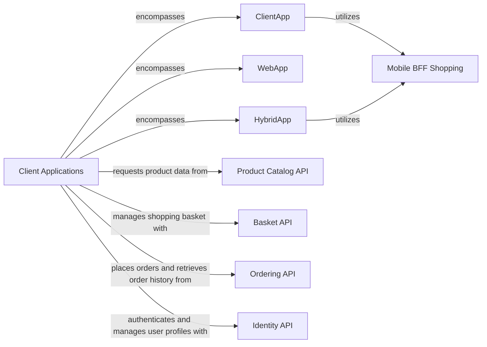

## Component Details

This overarching component represents the user-facing applications that serve as the primary interface for end-users to interact with the eShop system. It encompasses three distinct sub-components: a mobile application, a web application, and a hybrid application. Their collective purpose is to provide a seamless and intuitive experience for users to browse products, manage their shopping baskets, place orders, and view their order history.

### Client Applications
This overarching component represents the user-facing applications that serve as the primary interface for end-users to interact with the eShop system. It encompasses three distinct sub-components: a mobile application, a web application, and a hybrid application. Their collective purpose is to provide a seamless and intuitive experience for users to browse products, manage their shopping baskets, place orders, and view their order history.

**Related Classes/Methods**: _None_

### ClientApp
Represents the mobile application.

**Related Classes/Methods**: _None_

### WebApp
Represents the web application.

**Related Classes/Methods**: _None_

### HybridApp
Represents the hybrid application.

**Related Classes/Methods**: _None_

### Product Catalog API
API for retrieving product data.

**Related Classes/Methods**: _None_

### Basket API
API for managing shopping baskets.

**Related Classes/Methods**: _None_

### Ordering API
API for placing orders and retrieving order history.

**Related Classes/Methods**: _None_

### Identity API
API for user authentication and profile management.

**Related Classes/Methods**: _None_

### Mobile BFF Shopping
Backend For Frontend (BFF) for mobile clients, aggregating calls to multiple microservices.

**Related Classes/Methods**: _None_

### [FAQ](https://github.com/CodeBoarding/GeneratedOnBoardings/tree/main?tab=readme-ov-file#faq)