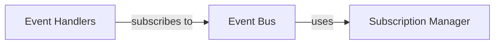

## Component Details

One paragraph explaining the functionality which is represented by this graph. What the main flow is and what is its purpose.

### Event Bus
Handles the distribution of events to various subscribers.

**Related Classes/Methods**: _None_

### Subscription Manager
Manages event subscriptions and dispatches events to registered handlers.

**Related Classes/Methods**: _None_

### Event Handlers
Processes specific types of events.

**Related Classes/Methods**: _None_

### [FAQ](https://github.com/CodeBoarding/GeneratedOnBoardings/tree/main?tab=readme-ov-file#faq)