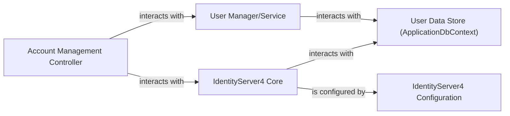

## Component Details

The Identity Service is a critical component responsible for managing user identities, authenticating users, and authorizing access to resources across the {project_name} ecosystem. It leverages IdentityServer4 to provide robust, token-based security. Its purpose is to act as a Security Token Service (STS), issuing identity tokens (for user information) and access tokens (for API authorization) to client applications and other services, ensuring secure and controlled access to system resources.

### IdentityServer4 Core
This is the heart of the Identity Service. It's the framework responsible for implementing OpenID Connect and OAuth 2.0 protocols. It handles token issuance, validation, client management, API resource definitions, and various authentication flows (e.g., authorization code, client credentials).

**Related Classes/Methods**: _None_

### Account Management Controller
This component exposes the user-facing endpoints for authentication and account management. It handles user login, logout, registration, and potentially consent screens. It orchestrates interactions between the user interface, the IdentityServer4 Core, and the User Manager.

**Related Classes/Methods**:

- `src/Identity.API/Quickstart/Account/AccountController.cs` (1:1)

### User Data Store (ApplicationDbContext)
This component is responsible for persisting user-related data (e.g., usernames, hashed passwords, claims) and potentially IdentityServer4's operational data (e.g., persisted grants, consent). It acts as the data access layer for identity-related information.

**Related Classes/Methods**:

- `src/Identity.API/Data/ApplicationDbContext.cs` (1:1)

### User Manager/Service
An abstraction layer that encapsulates the business logic for managing user accounts. It provides methods for creating, retrieving, updating, and deleting users, handling password hashing, and validating user credentials. It interacts directly with the User Data Store.

**Related Classes/Methods**: _None_

### IdentityServer4 Configuration
This component defines the security policies, registered clients (applications that can request tokens), API resources (APIs that are protected by the Identity Service), and identity resources (scopes that define user claims). It's crucial for setting up the security landscape.

**Related Classes/Methods**: _None_

### [FAQ](https://github.com/CodeBoarding/GeneratedOnBoardings/tree/main?tab=readme-ov-file#faq)