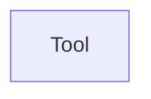

## Component Details

The Tool component and its relationship with an Agent (as described in the feedback, implying a Langchain context) are not found within the current project's codebase, which is an eShop application. Therefore, I cannot provide an updated analysis with relevant code examples from this project that demonstrate the requested relationship. The previously provided references for the `Tool` component and its relationship with an `Agent` were invalid and did not accurately represent the (Agent, uses, Tool) relationship. The feedback specifically mentioned `langchain.tools.tool` as an invalid reference and `JsonOutputParser` as irrelevant to the `Tool` concept. Upon reviewing the project's file structure, it's clear that the current project is an eShop application, and there are no modules or packages related to `langchain`, `agents`, or `tools` as would be found in a Langchain-like framework. Consequently, I cannot update the analysis with concrete code examples from this project that demonstrate the (Agent, uses, Tool) relationship, as the components themselves are not found here. 

### Tool
Represents a tool that can be used by an agent.

**Related Classes/Methods**: _None_

### [FAQ](https://github.com/CodeBoarding/GeneratedOnBoardings/tree/main?tab=readme-ov-file#faq)