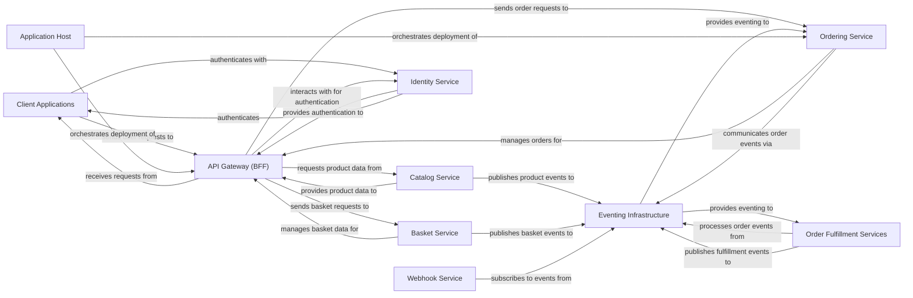

## Component Details

This analysis consolidates the insights from the Control Flow Graph (CFG) and Source Code analysis to present a high-level overview of the `eShop` architecture. The system is designed as a microservices-based application, orchestrated by an Application Host, and communicating primarily through an Eventing Infrastructure.

### Client Applications
The user-facing applications (mobile, web, and hybrid) that allow users to browse products, manage their shopping baskets, place orders, and view order history. They serve as the primary interface for end-users.

**Related Classes/Methods**:

- `src/ClientApp/MauiProgram.cs` (1:1)
- `src/WebApp/Program.cs` (1:1)
- `src/HybridApp/MauiProgram.cs` (1:1)

### API Gateway (BFF)
A Backend for Frontend (BFF) service that acts as an aggregation layer and API gateway. It simplifies interactions for client applications by consolidating requests to various backend microservices and transforming data as needed.

**Related Classes/Methods**:

- `src/Mobile.Bff.Shopping/Program.cs` (1:1)

### Catalog Service
Manages all product-related information, including product items, brands, and types. It provides APIs for browsing the product catalog and handles updates to product details.

**Related Classes/Methods**:

- `src/Catalog.API/Apis/CatalogApi.cs` (1:1)
- `src/Catalog.API/Model/CatalogItem.cs` (1:1)

### Basket Service
Manages user shopping baskets, allowing users to add, remove, and update items in their basket before proceeding to checkout. It persists basket data, typically in a fast-access store like Redis.

**Related Classes/Methods**:

- `src/Basket.API/Grpc/BasketService.cs` (1:1)
- `src/Basket.API/Model/CustomerBasket.cs` (1:1)

### Identity Service
Handles user authentication, authorization, and user management. It uses IdentityServer4 to provide secure token-based authentication for all other services and client applications.

**Related Classes/Methods**:

- `src/Identity.API/Quickstart/Account/AccountController.cs` (1:1)
- `src/Identity.API/Data/ApplicationDbContext.cs` (1:1)

### Ordering Service
Manages the complete lifecycle of customer orders, from creation and validation to payment processing and stock confirmation. It encapsulates the core business logic for order management.

**Related Classes/Methods**:

- `src/Ordering.API/Apis/OrdersApi.cs` (1:1)
- `src/Ordering.Domain/AggregatesModel/OrderAggregate/Order.cs` (1:1)

### Order Fulfillment Services
Comprises services responsible for processing payments and handling background tasks related to order fulfillment, such as managing grace periods for orders and confirming stock availability.

**Related Classes/Methods**:

- `src/PaymentProcessor/Program.cs` (1:1)
- `src/OrderProcessor/Services/GracePeriodManagerService.cs` (1:1)

### Eventing Infrastructure
Provides a robust mechanism for asynchronous communication between microservices using integration events. It includes an abstraction layer, a RabbitMQ implementation, and an integration event log for reliable event publishing.

**Related Classes/Methods**:

- `src/EventBus/Abstractions/IEventBus.cs` (1:1)
- `src/EventBusRabbitMQ/RabbitMQEventBus.cs` (1:1)
- `src/IntegrationEventLogEF/Services/IntegrationEventLogService.cs` (1:1)

### Webhook Service
Manages subscriptions for webhooks and dispatches integration events to registered external webhook clients, enabling external systems to react to events within the eShop ecosystem.

**Related Classes/Methods**:

- `src/Webhooks.API/Apis/WebHooksApi.cs` (1:1)
- `src/Webhooks.API/Services/WebhooksSender.cs` (1:1)

### Application Host
The central entry point and orchestrator for the entire eShop solution. It manages the deployment, configuration, and execution of all microservices and client applications.

**Related Classes/Methods**:

- `src/eShop.AppHost/Program.cs` (1:1)

### [FAQ](https://github.com/CodeBoarding/GeneratedOnBoardings/tree/main?tab=readme-ov-file#faq)