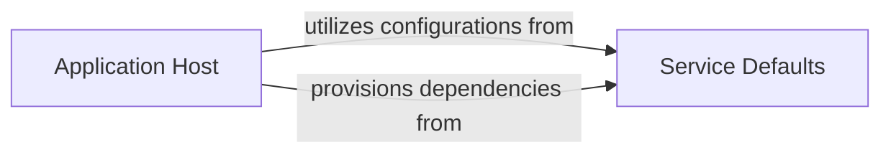

## Component Details

Abstract Components Overview for Application Host & Shared Defaults

### Application Host
This component is responsible for orchestrating the deployment, execution, and lifecycle management of all microservices and client applications within the eShop solution. It acts as the central point for defining how services are launched, configured, and interconnected.

**Related Classes/Methods**:

- `eShop.AppHost/Program.cs` (0:0)

### Service Defaults
This component encapsulates common configurations, extensions, and shared utilities that are consistently applied across multiple microservices. This includes functionalities like authentication, OpenAPI (Swagger) setup, health checks, and other cross-cutting concerns. Its purpose is to promote consistency, reduce duplication, and simplify the development of individual services.

**Related Classes/Methods**:

- `eShop.ServiceDefaults/Extensions.cs` (0:0)
- `eShop.ServiceDefaults/AuthenticationExtensions.cs` (0:0)
- `eShop.ServiceDefaults/OpenApi.Extensions.cs` (0:0)

### [FAQ](https://github.com/CodeBoarding/GeneratedOnBoardings/tree/main?tab=readme-ov-file#faq)