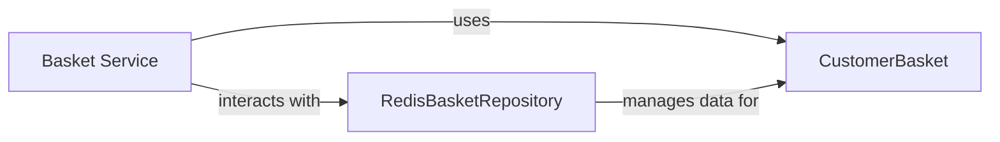

## Component Details

Conceptual analysis of the Basket Service subsystem, identifying core components and their relationships based on provided descriptions of C# files.

### Basket Service
Manages user shopping baskets, allowing users to add, update, and remove items before checkout. It also responds to events related to order creation (e.g., clearing the basket after an order is placed).

**Related Classes/Methods**:

- `BasketService` (1:1)

### CustomerBasket
Represents the data structure of a user's shopping basket, holding information about the items within it.

**Related Classes/Methods**:

- `CustomerBasket` (1:1)

### RedisBasketRepository
Handles the persistence and retrieval of `CustomerBasket` data, likely using Redis as the underlying data store. It acts as an intermediary between the `Basket Service` and the storage mechanism.

**Related Classes/Methods**:

- `RedisBasketRepository` (1:1)

### [FAQ](https://github.com/CodeBoarding/GeneratedOnBoardings/tree/main?tab=readme-ov-file#faq)