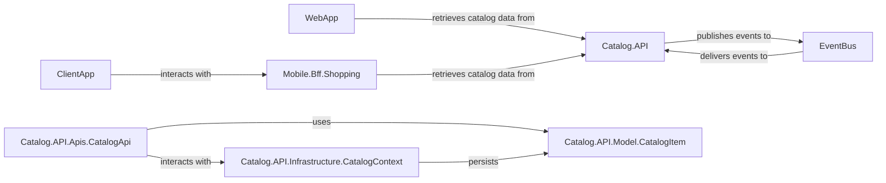

## Component Details

Analysis of the Catalog Service, a core microservice managing product catalog data, exposing APIs, and publishing events. This analysis identifies fundamental components and their relationships within the service and its interactions with external clients and messaging systems.

### Catalog.API
The main application component of the Catalog Service. It encapsulates the business logic for managing product details, brands, and types, providing RESTful APIs for data retrieval and handling. It also integrates with an `EventBus` to publish product-related events.

**Related Classes/Methods**:

- `Catalog.API` (1:1)

### Catalog.API.Apis.CatalogApi
This component serves as the public interface for the `Catalog.API`. It defines and exposes the RESTful endpoints (e.g., `/items`, `/items/{id}`, `/items/type/{typeId}/brand/{brandId}`) that external clients and other services use to interact with the product catalog. It orchestrates calls to underlying data access components.

**Related Classes/Methods**:

- `Catalog.API.Apis.CatalogApi` (1:1)

### Catalog.API.Model.CatalogItem
Represents the fundamental data structure for a product within the catalog. This class defines the properties (e.g., `Name`, `Description`, `Price`, `CatalogBrandId`, `CatalogTypeId`) that characterize a single catalog item, serving as the core domain entity.

**Related Classes/Methods**:

- `Catalog.API.Model.CatalogItem` (1:1)

### Catalog.API.Infrastructure.CatalogContext
This component is responsible for data persistence and retrieval for the catalog. It likely acts as the Entity Framework Core `DbContext`, managing the connection to the database and providing an abstraction layer for querying and saving `CatalogItem` and related entities (brands, types).

**Related Classes/Methods**:

- `Catalog.API.Infrastructure.CatalogContext` (1:1)

### EventBus
An asynchronous messaging system that facilitates communication between different microservices. The `Catalog.API` publishes events (e.g., product updated, product added) to the `EventBus`, allowing other interested services to subscribe and react to these changes without direct coupling.

**Related Classes/Methods**: _None_

### WebApp
A client application (likely a web-based frontend) that consumes data from the `Catalog.API`. It retrieves product information to display to users, enabling them to browse and search the catalog.

**Related Classes/Methods**: _None_

### Mobile.Bff.Shopping
A Backend for Frontend (BFF) specifically designed to serve mobile client applications. It acts as an aggregation layer, retrieving catalog data from the `Catalog.API` and potentially transforming or combining it before serving it to mobile clients.

**Related Classes/Methods**: _None_

### ClientApp
A generic client application that interacts with the `Mobile.Bff.Shopping`. This could represent various mobile applications (iOS, Android) that rely on the BFF for their data needs, including catalog information.

**Related Classes/Methods**: _None_

### [FAQ](https://github.com/CodeBoarding/GeneratedOnBoardings/tree/main?tab=readme-ov-file#faq)