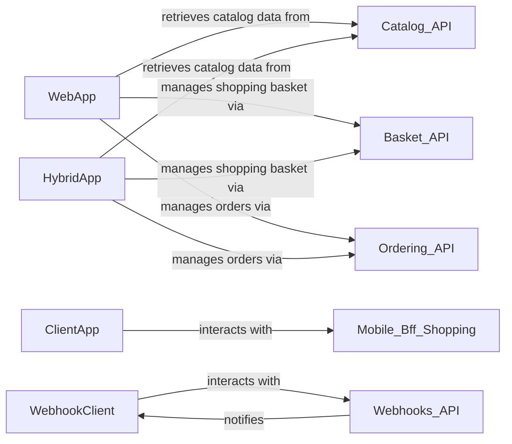

## Component Details

The Client Applications subsystem encompasses all user-facing interfaces, providing a comprehensive set of applications for user interaction, data presentation, and initiating business processes within the eShop system.

### WebApp
The primary web-based user interface for the eShop. It provides a comprehensive shopping experience by consuming APIs from other microservices.

**Related Classes/Methods**:

- `src/WebApp/Program.cs` (0:0)
- `src/WebApp/Components/Pages/Catalog/Catalog.razor` (0:0)
- `src/WebApp/Services/BasketService.cs` (0:0)
- `src/WebApp/Services/OrderingService.cs` (0:0)

### ClientApp
The native mobile client application for the eShop, developed using .NET MAUI. It offers a tailored mobile shopping experience.

**Related Classes/Methods**:

- `src/ClientApp/MauiProgram.cs` (0:0)
- `src/ClientApp/Views/CatalogView.xaml.cs` (0:0)
- `src/ClientApp/Services/Catalog/CatalogService.cs` (0:0)

### HybridApp
A hybrid mobile application, likely built using Blazor Hybrid or a similar technology, providing a cross-platform shopping experience.

**Related Classes/Methods**:

- `src/HybridApp/MauiProgram.cs` (0:0)
- `src/HybridApp/Components/Pages/Catalog/Catalog.razor` (0:0)
- `src/HybridApp/Services/CatalogService.cs` (0:0)

### WebhookClient
A dedicated client application designed to interact with the Webhooks.API. Its primary purpose is to register for webhook subscriptions and receive notifications about events occurring within the eShop system, enabling integration with external systems.

**Related Classes/Methods**:

- `src/WebhookClient/Program.cs` (0:0)
- `src/WebhookClient/Components/Pages/Home/Home.razor` (0:0)
- `src/WebhookClient/Services/WebHooksClient.cs` (0:0)

### [FAQ](https://github.com/CodeBoarding/GeneratedOnBoardings/tree/main?tab=readme-ov-file#faq)