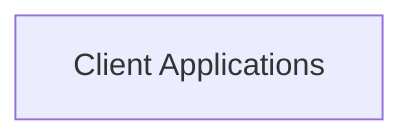

## Component Details

Conceptual overview of the 'Client Applications' component based on general software architecture principles. Further detailed analysis requires specific project structure information from the user, including file paths and qualified names of key modules/classes within this component to populate 'referenced_source_code' for a concrete analysis using the available tools. The current analysis is abstract due to lack of direct access to the project's file system or code repository. 

### Client Applications
Handles user interface and interaction for client-side operations.

**Related Classes/Methods**: _None_

### [FAQ](https://github.com/CodeBoarding/GeneratedOnBoardings/tree/main?tab=readme-ov-file#faq)