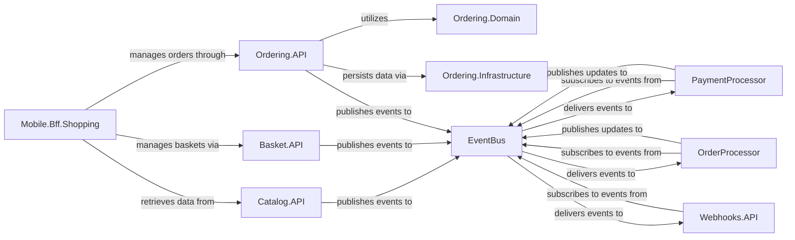

## Component Details

This subsystem encapsulates the primary business logic of the e-commerce system, managing the product catalog, handling shopping baskets, processing orders, managing payments, and dispatching webhooks. It also features a Mobile Backend for Frontend (BFF) to optimize mobile client interactions and a background order processor for specific order-related tasks.

### Catalog.API
Manages the product catalog, including product details, brands, and types. It provides APIs for retrieving catalog items and handling product-related data.

**Related Classes/Methods**:

- `src/Catalog.API/` (1:1)
- `src/Catalog.API/Apis/CatalogApi.cs` (1:1)
- `src/Catalog.API/Model/CatalogItem.cs` (1:1)
- `src/Catalog.API/Infrastructure/CatalogContext.cs` (1:1)

### Basket.API
Handles user shopping baskets, allowing users to add, remove, and update items in their cart. It stores basket data, typically in a fast-access store like Redis.

**Related Classes/Methods**:

- `src/Basket.API/` (1:1)
- `src/Basket.API/Grpc/BasketService.cs` (1:1)
- `src/Basket.API/Model/CustomerBasket.cs` (1:1)
- `src/Basket.API/Repositories/RedisBasketRepository.cs` (1:1)

### Ordering.API
Manages the order lifecycle, from creation to shipping. It handles order validation, persistence, and status updates, often integrating with other services for stock confirmation and payment.

**Related Classes/Methods**:

- `src/Ordering.API/` (1:1)
- `src/Ordering.API/Apis/OrdersApi.cs` (1:1)
- `src/Ordering.API/Application/Commands/CreateOrderCommand.cs` (1:1)

### Ordering.Domain
Contains the core domain model for the ordering subsystem, including aggregates like Order and Buyer, and defines domain events.

**Related Classes/Methods**:

- `src/Ordering.Domain/` (1:1)
- `src/Ordering.Domain/AggregatesModel/OrderAggregate/Order.cs` (1:1)
- `src/Ordering.Domain/AggregatesModel/BuyerAggregate/Buyer.cs` (1:1)

### Ordering.Infrastructure
Provides the infrastructure concerns for the ordering subsystem, such as data persistence (Entity Framework Core context and migrations) and repository implementations for Order and Buyer aggregates.

**Related Classes/Methods**:

- `src/Ordering.Infrastructure/` (1:1)
- `src/Ordering.Infrastructure/OrderingContext.cs` (1:1)
- `src/Ordering.Infrastructure/Repositories/OrderRepository.cs` (1:1)
- `src/Ordering.Infrastructure/Repositories/BuyerRepository.cs` (1:1)

### PaymentProcessor
A background service responsible for processing payments for orders. It listens for payment-related events and interacts with a payment gateway (simulated or real).

**Related Classes/Methods**:

- `src/PaymentProcessor/` (1:1)
- `src/PaymentProcessor/Program.cs` (1:1)
- `src/PaymentProcessor/IntegrationEvents/EventHandling/OrderStatusChangedToStockConfirmedIntegrationEventHandler.cs` (1:1)

### Webhooks.API
Manages webhook subscriptions and dispatches events to registered external clients. It allows third-party applications to receive notifications about events within the eShop.

**Related Classes/Methods**:

- `src/Webhooks.API/` (1:1)
- `src/Webhooks.API/Apis/WebHooksApi.cs` (1:1)
- `src/Webhooks.API/Model/WebhookSubscription.cs` (1:1)
- `src/Webhooks.API/Services/WebhooksSender.cs` (1:1)

### Mobile.Bff.Shopping
A Backend for Frontend (BFF) specifically designed for the mobile client application. It aggregates and transforms data from various microservices to optimize communication for mobile devices.

**Related Classes/Methods**:

- `src/Mobile.Bff.Shopping/` (1:1)
- `src/Mobile.Bff.Shopping/Program.cs` (1:1)
- `src/Mobile.Bff.Shopping/Extensions/Extensions.cs` (1:1)

### OrderProcessor
A background service that handles various order-related tasks, such as managing grace periods for orders or confirming stock. It reacts to events from the ordering system.

**Related Classes/Methods**:

- `src/OrderProcessor/` (1:1)
- `src/OrderProcessor/Program.cs` (1:1)
- `src/OrderProcessor/Services/GracePeriodManagerService.cs` (1:1)

### EventBus
A central communication hub facilitating asynchronous communication and decoupling between various e-commerce services.

**Related Classes/Methods**: _None_

### [FAQ](https://github.com/CodeBoarding/GeneratedOnBoardings/tree/main?tab=readme-ov-file#faq)