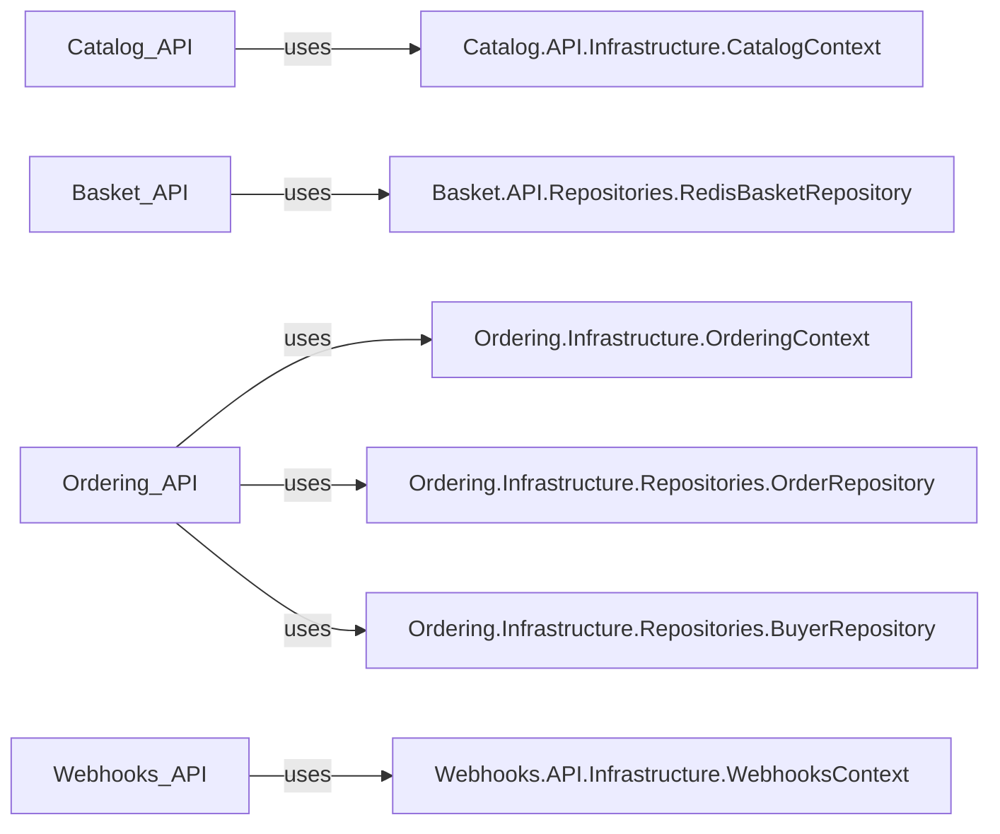

## Component Details

The `Data Storage` component is crucial for the persistence and retrieval of all application data, encompassing relational databases for core business entities and a Redis cache for high-speed, temporary data. This subsystem is fundamental as it underpins the entire application's ability to manage product catalogs, process orders, handle user baskets, and manage webhook subscriptions. Without these storage mechanisms, the application would lack state and operational capability.

### Catalog.API.Infrastructure.CatalogContext
This is the Entity Framework Core `DbContext` for the Catalog microservice. It acts as the gateway for all database operations related to the product catalog, managing connections, queries, and updates for product information. It's fundamental because it provides the structured storage for all product-related data, which is central to an e-commerce application.

**Related Classes/Methods**:

- `Catalog.API.Infrastructure.CatalogContext` (1:1)

### Basket.API.Repositories.RedisBasketRepository
This component is responsible for the high-speed storage and retrieval of user shopping basket data. By leveraging Redis, it ensures quick access to volatile basket information, which is critical for a responsive user experience during shopping. It's fundamental for managing transient user session data efficiently.

**Related Classes/Methods**:

- `Basket.API.Repositories.RedisBasketRepository` (1:1)

### Ordering.Infrastructure.OrderingContext
As the Entity Framework Core `DbContext` for the Ordering microservice, this component manages all database interactions concerning order details, buyer information, and payment methods. It is fundamental as it provides the persistent storage for all transactional order data, which is the core of the ordering process.

**Related Classes/Methods**:

- `Ordering.Infrastructure.OrderingContext` (1:1)

### Ordering.Infrastructure.Repositories.OrderRepository
This repository provides an abstraction layer over the `OrderingContext` specifically for order-related data. It encapsulates the logic for accessing and manipulating order entities, promoting a clean separation of concerns and making data access more manageable. It's fundamental for providing a structured way to interact with order data.

**Related Classes/Methods**:

- `Ordering.Infrastructure.Repositories.OrderRepository` (1:1)

### Ordering.Infrastructure.Repositories.BuyerRepository
Similar to the `OrderRepository`, this component provides an abstraction for accessing and managing buyer information within the `OrderingContext`. It ensures that buyer data operations are consistent and isolated. It's fundamental for managing customer-specific data related to orders.

**Related Classes/Methods**:

- `Ordering.Infrastructure.Repositories.BuyerRepository` (1:1)

### Webhooks.API.Infrastructure.WebhooksContext
This is the Entity Framework Core `DbContext` for the Webhooks microservice, handling database operations for webhook subscriptions. It's fundamental for persisting the configuration and state of external integrations and notifications.

**Related Classes/Methods**:

- `Webhooks.API.Infrastructure.WebhooksContext` (1:1)

### [FAQ](https://github.com/CodeBoarding/GeneratedOnBoardings/tree/main?tab=readme-ov-file#faq)