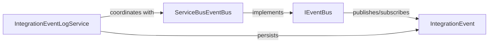

## Component Details

The Event Bus System provides a robust and reliable mechanism for asynchronous, event-driven communication between microservices. It ensures message delivery and atomicity of event publishing, crucial for maintaining data consistency across distributed systems.

### IEventBus
This is the core abstraction layer for the event bus. It defines the contract for publishing and subscribing to integration events, decoupling the application logic from the underlying messaging infrastructure. It's fundamental because it allows for interchangeable messaging implementations without affecting the services that use the event bus.

**Related Classes/Methods**:

- `IEventBus` (1:1)

### ServiceBusEventBus
This component is a concrete implementation of the `IEventBus` interface, specifically leveraging Azure Service Bus for message queuing and topic-based communication. It handles the actual interaction with the message broker, including serialization, publishing, and subscription management. It's fundamental as it provides the actual messaging capabilities.

**Related Classes/Methods**:

- `ServiceBusEventBus` (1:1)

### IntegrationEvent
Represents a specific event that occurs within a microservice and needs to be communicated to other services. These events are typically immutable messages containing data relevant to the change that occurred. It's fundamental as it defines the payload and type of communication.

**Related Classes/Methods**:

- `IntegrationEvent` (1:1)

### IntegrationEventLogService
This service is responsible for implementing the Outbox Pattern, ensuring atomicity of event publishing. Before an event is published to the message broker, it's first persisted in a local transaction log (the "outbox"). This guarantees that the event is recorded even if the publishing to the message broker fails, and it can be retried later. It's fundamental for ensuring reliable and atomic event publishing in a distributed system.

**Related Classes/Methods**:

- `IntegrationEventLogService` (1:1)

### [FAQ](https://github.com/CodeBoarding/GeneratedOnBoardings/tree/main?tab=readme-ov-file#faq)