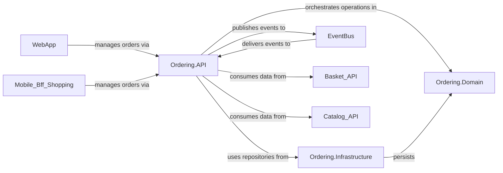

## Component Details

The `Ordering Service` is a critical subsystem responsible for the creation, management, and lifecycle of customer orders. It orchestrates order status transitions and integrates with various external systems, such as payment and stock services. This service is designed with a clear separation of concerns, adhering to Domain-Driven Design principles, which is evident in its three fundamental components: `Ordering.API`, `Ordering.Domain`, and `Ordering.Infrastructure`.

### Ordering.API
This component serves as the public-facing interface of the `Ordering Service`. It exposes RESTful endpoints that allow external clients and other services to interact with the ordering system. It acts as an orchestrator, receiving commands (e.g., `CreateOrderCommand`), dispatching them to the application layer for processing, and publishing integration events (e.g., `OrderPaymentSucceededIntegrationEventHandler`, `OrderStockConfirmedIntegrationEventHandler`) to notify other services about changes in order status.

**Related Classes/Methods**:

- `Ordering.API.Apis.OrdersApi` (0:0)
- `Ordering.API.Application.Commands.CreateOrderCommand` (0:0)
- `Ordering.API.Application.Commands.CreateOrderCommandHandler` (0:0)
- `Ordering.API.Application.Queries.OrderQueries` (0:0)
- `Ordering.API.Application.IntegrationEvents.EventHandling.OrderPaymentSucceededIntegrationEventHandler` (0:0)
- `Ordering.API.Application.IntegrationEvents.EventHandling.OrderStockConfirmedIntegrationEventHandler` (0:0)

### Ordering.Domain
This component encapsulates the core business logic and the rich domain model for orders. It defines the aggregates (`Order`, `Buyer`), entities (`OrderItem`), value objects (`OrderStatus`), and domain events (`OrderStartedDomainEvent`) that represent the essential business concepts and rules of the ordering process. This layer is intentionally kept independent of any infrastructure concerns, ensuring a clean separation of concerns and a pure representation of the business domain.

**Related Classes/Methods**:

- `Ordering.Domain.AggregatesModel.OrderAggregate.Order` (0:0)
- `Ordering.Domain.AggregatesModel.OrderAggregate.OrderItem` (0:0)
- `Ordering.Domain.AggregatesModel.OrderAggregate.OrderStatus` (0:0)
- `Ordering.Domain.AggregatesModel.BuyerAggregate.Buyer` (0:0)
- `Ordering.Domain.Events.OrderStartedDomainEvent` (0:0)
- `Ordering.Domain.SeedWork.IAggregateRoot` (0:0)
- `Ordering.Domain.SeedWork.IRepository<T>` (0:0)

### Ordering.Infrastructure
This component is responsible for implementing the persistence mechanisms for the `Ordering Domain`, primarily utilizing Entity Framework Core for database interactions. It translates the domain objects into database records and manages transactions to ensure data integrity. Additionally, it incorporates idempotency mechanisms (`RequestManager`) to handle duplicate requests effectively in a distributed environment, preventing unintended side effects.

**Related Classes/Methods**:

- `Ordering.Infrastructure.OrderingContext` (0:0)
- `Ordering.Infrastructure.Repositories.OrderRepository` (0:0)
- `Ordering.Infrastructure.Repositories.BuyerRepository` (0:0)
- `Ordering.Infrastructure.Idempotency.RequestManager` (0:0)

### [FAQ](https://github.com/CodeBoarding/GeneratedOnBoardings/tree/main?tab=readme-ov-file#faq)