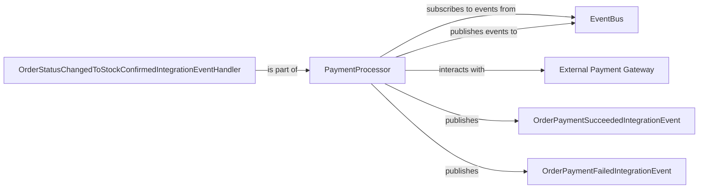

## Component Details

The Payment Service is a critical subsystem responsible for handling payment requests within the larger order processing flow. Its primary purpose is to process payments, communicate their outcomes, and integrate with external financial systems.

### PaymentProcessor
This is the core component of the Payment Service. It acts as a dedicated background service that orchestrates the payment processing workflow. Its main responsibilities include: Subscribing to order-related events (e.g., OrderStatusChangedToStockConfirmedIntegrationEvent) to initiate payment processing. Interacting with an External Payment Gateway to perform actual financial transactions. Publishing integration events (OrderPaymentSucceededIntegrationEvent or OrderPaymentFailedIntegrationEvent) to notify other services about the payment outcome.

**Related Classes/Methods**:

- `PaymentProcessor.Program` (1:1)
- `PaymentProcessor.IntegrationEvents.EventHandling.OrderStatusChangedToStockConfirmedIntegrationEventHandler` (1:1)

### EventBus
A central messaging infrastructure that facilitates asynchronous, decoupled communication between different services. It acts as a conduit for integration events, allowing services to publish and subscribe to messages without direct knowledge of each other.

**Related Classes/Methods**: _None_

### External Payment Gateway
An external, third-party system responsible for securely processing actual financial transactions (e.g., credit card payments, bank transfers). The PaymentProcessor interacts with this gateway to authorize, capture, or refund payments.

**Related Classes/Methods**: _None_

### OrderStatusChangedToStockConfirmedIntegrationEventHandler
A specific event handler within the PaymentProcessor that listens for the OrderStatusChangedToStockConfirmedIntegrationEvent. Upon receiving this event, it triggers the payment processing logic for the associated order.

**Related Classes/Methods**:

- `PaymentProcessor.IntegrationEvents.EventHandling.OrderStatusChangedToStockConfirmedIntegrationEventHandler` (1:1)

### OrderPaymentSucceededIntegrationEvent
An integration event published by the PaymentProcessor when a payment has been successfully processed. This event carries information about the successful payment, allowing other services (e.g., Order Service) to update the order status accordingly.

**Related Classes/Methods**:

- `PaymentProcessor.IntegrationEvents.Events.OrderPaymentSucceededIntegrationEvent` (1:1)

### OrderPaymentFailedIntegrationEvent
An integration event published by the PaymentProcessor when a payment attempt fails. This event informs other services about the failure, allowing them to handle the situation (e.g., notify the customer, revert order status).

**Related Classes/Methods**:

- `PaymentProcessor.IntegrationEvents.Events.OrderPaymentFailedIntegrationEvent` (1:1)

### [FAQ](https://github.com/CodeBoarding/GeneratedOnBoardings/tree/main?tab=readme-ov-file#faq)