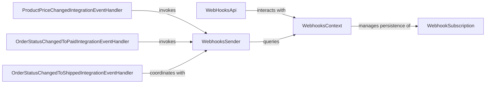

## Component Details

The Webhooks Service in eShopOnAzure is designed to manage webhook subscriptions and dispatch notifications to registered clients when specific integration events occur. This service acts as a crucial communication bridge, enabling other services or external applications to react to changes within the eShop system in real-time.

### WebHooksApi
This component serves as the public API endpoint for managing webhook subscriptions. It exposes functionalities for clients to register, view, and remove their webhook subscriptions.

**Related Classes/Methods**:

- `WebHooksApi` (1:1)

### WebhookSubscription
This is the data model that represents a single webhook subscription. It encapsulates information such as the event type the client is interested in (e.g., product price change, order status update) and the callback URL where the notification should be sent.

**Related Classes/Methods**:

- `WebhookSubscription` (1:1)

### WebhooksSender
This service is responsible for the actual dispatch of webhook notifications. When an integration event occurs, the WebhooksSender retrieves the relevant subscriptions and sends the event payload to the registered callback URLs.

**Related Classes/Methods**:

- `WebhooksSender` (1:1)

### WebhooksContext
This component, likely an Entity Framework Core DbContext, manages the persistence of WebhookSubscription data in the database. It provides the necessary methods for storing, retrieving, updating, and deleting webhook subscriptions.

**Related Classes/Methods**:

- `WebhooksContext` (1:1)

### ProductPriceChangedIntegrationEventHandler
This event handler listens for ProductPriceChangedIntegrationEvent messages from the system's event bus. Upon receiving such an event, it identifies the relevant webhook subscriptions and instructs the WebhooksSender to dispatch notifications.

**Related Classes/Methods**:

- `ProductPriceChangedIntegrationEventHandler` (1:1)

### OrderStatusChangedToPaidIntegrationEventHandler
Similar to the ProductPriceChangedIntegrationEventHandler, this component listens for OrderStatusChangedToPaidIntegrationEvent messages. When an order's status changes to "paid," this handler triggers the WebhooksSender to notify subscribed clients.

**Related Classes/Methods**:

- `OrderStatusChangedToPaidIntegrationEventHandler` (1:1)

### OrderStatusChangedToShippedIntegrationEventHandler
This handler is responsible for processing OrderStatusChangedToShippedIntegrationEvent messages. Upon an order being marked as "shipped," it coordinates with the WebhooksSender to send out notifications to relevant subscribers.

**Related Classes/Methods**:

- `OrderStatusChangedToShippedIntegrationEventHandler` (1:1)

### [FAQ](https://github.com/CodeBoarding/GeneratedOnBoardings/tree/main?tab=readme-ov-file#faq)