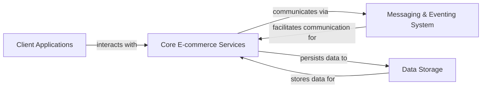

## Component Details

Final Architecture Overview for eShopOnAzure

### Client Applications
Provides all user-facing interfaces, including the web application, native mobile application, hybrid application, and a dedicated webhook client. These applications are responsible for user interaction, data presentation, and initiating business processes.

**Related Classes/Methods**:

- `src/WebApp/` (1:1)
- `src/ClientApp/` (1:1)
- `src/HybridApp/` (1:1)
- `src/WebhookClient/` (1:1)

### Core E-commerce Services
Encapsulates the primary business logic of the e-commerce system. This includes managing the product catalog, handling shopping baskets, processing orders, managing payments, and dispatching webhooks. It also features a Mobile Backend for Frontend (BFF) to optimize mobile client interactions and a background order processor for specific order-related tasks.

**Related Classes/Methods**:

- `src/Catalog.API/` (1:1)
- `src/Basket.API/` (1:1)
- `src/Ordering.API/` (1:1)
- `src/Ordering.Domain/` (1:1)
- `src/Ordering.Infrastructure/` (1:1)
- `src/PaymentProcessor/` (1:1)
- `src/Webhooks.API/` (1:1)
- `src/Mobile.Bff.Shopping/` (1:1)
- `src/OrderProcessor/` (1:1)

### Messaging & Eventing System
Facilitates asynchronous, event-driven communication between the various microservices. It provides an abstract event bus, an Azure Service Bus implementation for message queuing, and an integration event log to ensure reliable event publishing through a transactional outbox pattern.

**Related Classes/Methods**:

- `src/EventBus/` (1:1)
- `src/EventBusServiceBus/` (1:1)
- `src/IntegrationEventLogEF/` (1:1)

### Data Storage
Provides the persistent storage and caching mechanisms for all application data. This includes relational databases for the product catalog, order details, and webhook subscriptions, as well as a Redis cache for temporary user shopping basket data.

**Related Classes/Methods**:

- `src/Catalog.API/Infrastructure/` (1:1)
- `src/Basket.API/Repositories/` (1:1)
- `src/Ordering.Infrastructure/` (1:1)
- `src/Webhooks.API/Infrastructure/` (1:1)

### [FAQ](https://github.com/CodeBoarding/GeneratedOnBoardings/tree/main?tab=readme-ov-file#faq)