```mermaid
graph LR
    Catalog_Service["Catalog Service"]
    Basket_Service["Basket Service"]
    Ordering_Service["Ordering Service"]
    Payment_Service["Payment Service"]
    Webhooks_Service["Webhooks Service"]
    Event_Bus_System["Event Bus System"]
    Client_Applications["Client Applications"]
    Mobile_BFF["Mobile BFF"]
    Order_Background_Processor["Order Background Processor"]
    Application_Host_Shared_Defaults["Application Host & Shared Defaults"]
    Catalog_Service -- "serves product data to" --> Client_Applications
    Catalog_Service -- "publishes events to" --> Event_Bus_System
    Basket_Service -- "manages user baskets for" --> Client_Applications
    Basket_Service -- "subscribes to events from" --> Event_Bus_System
    Client_Applications -- "sends order requests to" --> Ordering_Service
    Ordering_Service -- "communicates via" --> Event_Bus_System
    Payment_Service -- "communicates via" --> Event_Bus_System
    Payment_Service -- "processes payments for" --> Ordering_Service
    Webhooks_Service -- "subscribes to events from" --> Event_Bus_System
    Event_Bus_System -- "facilitates communication with" --> Catalog_Service
    Event_Bus_System -- "facilitates communication with" --> Basket_Service
    Event_Bus_System -- "facilitates communication with" --> Ordering_Service
    Event_Bus_System -- "facilitates communication with" --> Payment_Service
    Event_Bus_System -- "facilitates communication with" --> Webhooks_Service
    Event_Bus_System -- "facilitates communication with" --> Order_Background_Processor
    Client_Applications -- "interacts with" --> Catalog_Service
    Client_Applications -- "interacts with" --> Ordering_Service
    Mobile_BFF -- "serves" --> Client_Applications
    Mobile_BFF -- "aggregates data from" --> Catalog_Service
    Mobile_BFF -- "aggregates data from" --> Basket_Service
    Mobile_BFF -- "aggregates data from" --> Ordering_Service
    Order_Background_Processor -- "subscribes to events from" --> Event_Bus_System
    Order_Background_Processor -- "manages order lifecycle in conjunction with" --> Ordering_Service
    Application_Host_Shared_Defaults -- "orchestrates deployment of" --> Catalog_Service
    Application_Host_Shared_Defaults -- "provides utilities to" --> Catalog_Service
    Application_Host_Shared_Defaults -- "orchestrates deployment of" --> Basket_Service
    Application_Host_Shared_Defaults -- "provides utilities to" --> Basket_Service
    Application_Host_Shared_Defaults -- "orchestrates deployment of" --> Ordering_Service
    Application_Host_Shared_Defaults -- "provides utilities to" --> Ordering_Service
    Application_Host_Shared_Defaults -- "orchestrates deployment of" --> Payment_Service
    Application_Host_Shared_Defaults -- "provides utilities to" --> Payment_Service
    Application_Host_Shared_Defaults -- "orchestrates deployment of" --> Webhooks_Service
    Application_Host_Shared_Defaults -- "provides utilities to" --> Webhooks_Service
    Application_Host_Shared_Defaults -- "orchestrates deployment of" --> Event_Bus_System
    Application_Host_Shared_Defaults -- "provides utilities to" --> Event_Bus_System
    Application_Host_Shared_Defaults -- "orchestrates deployment of" --> Client_Applications
    Application_Host_Shared_Defaults -- "provides utilities to" --> Client_Applications
    Application_Host_Shared_Defaults -- "orchestrates deployment of" --> Mobile_BFF
    Application_Host_Shared_Defaults -- "provides utilities to" --> Mobile_BFF
    Application_Host_Shared_Defaults -- "orchestrates deployment of" --> Order_Background_Processor
    Application_Host_Shared_Defaults -- "provides utilities to" --> Order_Background_Processor
    click Catalog_Service href "https://github.com/CodeBoarding/GeneratedOnBoardings/blob/main//eShopOnAzure/Catalog_Service.md" "Details"
    click Basket_Service href "https://github.com/CodeBoarding/GeneratedOnBoardings/blob/main//eShopOnAzure/Basket_Service.md" "Details"
    click Ordering_Service href "https://github.com/CodeBoarding/GeneratedOnBoardings/blob/main//eShopOnAzure/Ordering_Service.md" "Details"
    click Payment_Service href "https://github.com/CodeBoarding/GeneratedOnBoardings/blob/main//eShopOnAzure/Payment_Service.md" "Details"
    click Webhooks_Service href "https://github.com/CodeBoarding/GeneratedOnBoardings/blob/main//eShopOnAzure/Webhooks_Service.md" "Details"
    click Event_Bus_System href "https://github.com/CodeBoarding/GeneratedOnBoardings/blob/main//eShopOnAzure/Event_Bus_System.md" "Details"
    click Client_Applications href "https://github.com/CodeBoarding/GeneratedOnBoardings/blob/main//eShopOnAzure/Client_Applications.md" "Details"
    click Application_Host_Shared_Defaults href "https://github.com/CodeBoarding/GeneratedOnBoardings/blob/main//eShopOnAzure/Application_Host_Shared_Defaults.md" "Details"
```

## Component Details

Final Architecture Analysis for eShopOnAzure

### Catalog Service
Manages the product catalog, including items, brands, and types. It provides APIs for browsing and searching products and publishes events related to product changes.

**Related Classes/Methods**:

- `Apis/CatalogApi.cs` (1:1)
- `Model/CatalogItem.cs` (1:1)
- `Infrastructure/CatalogContext.cs` (1:1)

### Basket Service
Manages user shopping baskets, allowing users to add, update, and remove items before checkout. It also responds to events related to order creation (e.g., clearing the basket after an order is placed).

**Related Classes/Methods**:

- `Grpc/BasketService.cs` (1:1)
- `Model/CustomerBasket.cs` (1:1)
- `Repositories/RedisBasketRepository.cs` (1:1)

### Ordering Service
Handles the creation, management, and lifecycle of customer orders. It manages order status transitions and integrates with payment and stock systems.

**Related Classes/Methods**:

- `Apis/OrdersApi.cs` (1:1)
- `Application/Commands/CreateOrderCommand.cs` (1:1)
- `Domain/AggregatesModel/OrderAggregate/Order.cs` (1:1)

### Payment Service
Processes payment requests for orders. It publishes events indicating payment success or failure, integrating with the overall order flow.

**Related Classes/Methods**:

- `Program.cs (related to payment processing)` (1:1)
- `IntegrationEvents/EventHandling/OrderStatusChangedToStockConfirmedIntegrationEventHandler.cs` (1:1)

### Webhooks Service
Manages webhook subscriptions and dispatches notifications to registered clients when specific integration events occur (e.g., product price changes, order status updates).

**Related Classes/Methods**:

- `Apis/WebHooksApi.cs` (1:1)
- `Model/WebhookSubscription.cs` (1:1)
- `Services/WebhooksSender.cs` (1:1)

### Event Bus System
Provides an abstraction layer for asynchronous, event-driven communication between microservices. It implements reliable message queuing and topic-based communication (e.g., using Azure Service Bus) and ensures atomicity of event publishing (Outbox Pattern).

**Related Classes/Methods**:

- `Abstractions/IEventBus.cs` (1:1)
- `Events/IntegrationEvent.cs` (1:1)
- `ServiceBusEventBus.cs` (1:1)
- `Services/IntegrationEventLogService.cs` (1:1)

### Client Applications
Represents the primary user interfaces (web, mobile, hybrid) for browsing products, managing the basket, placing orders, and viewing order history.

**Related Classes/Methods**:

- `Components/Pages/Catalog/Catalog.razor` (1:1)
- `Services/BasketService.cs` (1:1)
- `Services/OrderingService.cs` (1:1)
- `Views/CatalogView.xaml.cs` (1:1)
- `Services/Basket/BasketService.cs` (1:1)
- `Services/Order/OrderService.cs` (1:1)

### Mobile BFF
Acts as a Backend-for-Frontend specifically for mobile clients, aggregating and transforming data from various microservices (Catalog, Basket, Ordering) to simplify mobile client development.

**Related Classes/Methods**:

- `Program.cs (Mobile BFF Shopping)` (1:1)
- `Extensions/Extensions.cs (Mobile BFF Shopping)` (1:1)

### Order Background Processor
Manages background tasks related to order processing, such as handling grace periods for order confirmation and other asynchronous order-related operations.

**Related Classes/Methods**:

- `Services/GracePeriodManagerService.cs` (1:1)
- `Program.cs (Order Processor)` (1:1)

### Application Host & Shared Defaults
Orchestrates and manages the deployment and execution of all microservices and client applications. It provides common configurations, extensions, and shared utilities (e.g., authentication, OpenAPI setup) used across multiple services to promote consistency.

**Related Classes/Methods**:

- `Program.cs (eShop.AppHost)` (1:1)
- `Extensions.cs (eShop.ServiceDefaults)` (1:1)
- `AuthenticationExtensions.cs` (1:1)
- `OpenApi.Extensions.cs` (1:1)

### [FAQ](https://github.com/CodeBoarding/GeneratedOnBoardings/tree/main?tab=readme-ov-file#faq)