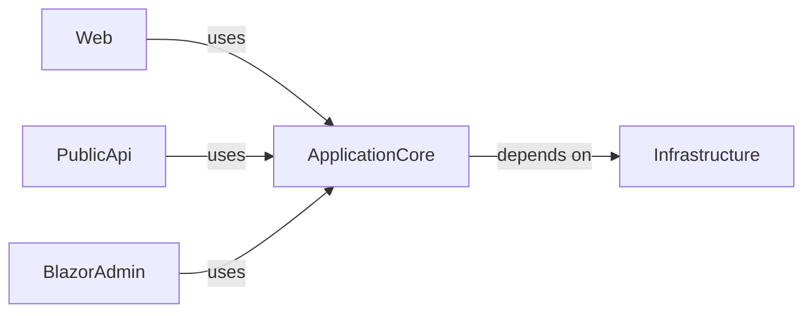

## Details

Analysis of a .NET project with identified components and their general relationships.

### ApplicationCore [[Expand]](./ApplicationCore.md)
Core application logic and business rules.

**Related Classes/Methods**: _None_

### Infrastructure [[Expand]](./Infrastructure.md)
Handles data access, external services, and other infrastructure concerns.

**Related Classes/Methods**: _None_

### Web [[Expand]](./Web.md)
Web-facing components, likely ASP.NET Core MVC or Razor Pages.

**Related Classes/Methods**: _None_

### PublicApi [[Expand]](./PublicApi.md)
Provides an API for external consumption.

**Related Classes/Methods**: _None_

### BlazorAdmin [[Expand]](./BlazorAdmin.md)
Administrative interface built with Blazor.

**Related Classes/Methods**: _None_

### [FAQ](https://github.com/CodeBoarding/GeneratedOnBoardings/tree/main?tab=readme-ov-file#faq)