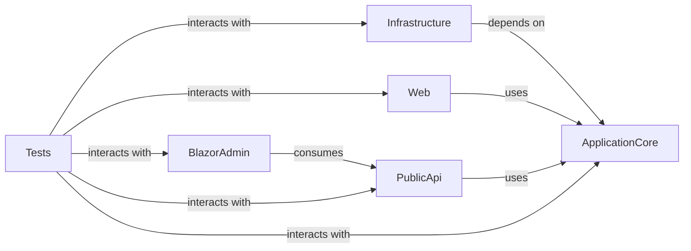

## Details

This analysis describes a .NET project architecture. Specific code references could not be provided as the available tools are for Python, and the project context (e.g., package name) was not supplied for a .NET codebase.

### ApplicationCore [[Expand]](./ApplicationCore.md)
Encapsulates the core business logic, domain models, and application services. It defines the interfaces for data access and external services, ensuring the business rules remain independent of infrastructure concerns.

**Related Classes/Methods**: _None_

### Infrastructure [[Expand]](./Infrastructure.md)
Implements data persistence (e.g., Entity Framework Core with SQL Server) and integrates with external services. It provides concrete implementations for interfaces defined in ApplicationCore, adhering to the Dependency Inversion Principle.

**Related Classes/Methods**: _None_

### Web [[Expand]](./Web.md)
The primary presentation layer for the customer-facing e-commerce website, built with ASP.NET Core MVC/Razor Pages. It handles user requests, renders views, and interacts with ApplicationCore to fulfill business operations.

**Related Classes/Methods**: _None_

### PublicApi [[Expand]](./PublicApi.md)
An ASP.NET Core Web API serving as the primary interface for external clients, including the BlazorAdmin application. It exposes RESTful endpoints for various e-commerce functionalities and interacts with ApplicationCore to process requests.

**Related Classes/Methods**: _None_

### BlazorAdmin [[Expand]](./BlazorAdmin.md)
A client-side Blazor WebAssembly application providing a rich administrative user interface. It enables back-office operations such as product management, order processing, and user administration by consuming the PublicApi.

**Related Classes/Methods**: _None_

### Tests [[Expand]](./Tests.md)
A collection of test projects (e.g., unit, integration, and UI tests) that ensure the correctness, reliability, and maintainability of all other components. It covers ApplicationCore, Infrastructure, Web, PublicApi, and BlazorAdmin.

**Related Classes/Methods**: _None_

### [FAQ](https://github.com/CodeBoarding/GeneratedOnBoardings/tree/main?tab=readme-ov-file#faq)