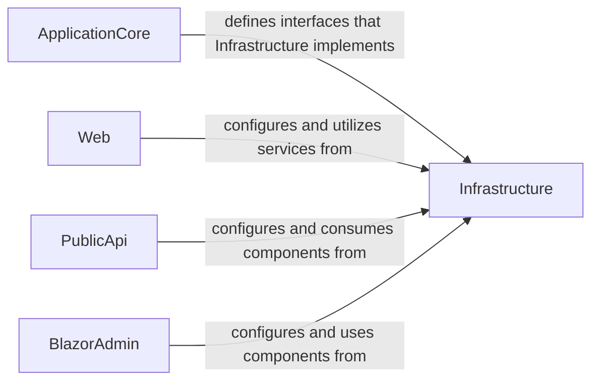

## Details

One paragraph explaining the functionality which is represented by this graph. What the main flow is and what is its purpose.

### ApplicationCore [[Expand]](./ApplicationCore.md)
The `ApplicationCore` component encapsulates the core business logic and domain model of the eShopOnWeb application. It defines interfaces and abstractions that represent the application's operations and data contracts, which are then implemented by the `Infrastructure` layer. This adherence to the Dependency Inversion Principle ensures that the business rules are independent of specific technology implementations.

**Related Classes/Methods**: _None_

### Infrastructure [[Expand]](./Infrastructure.md)
The `Infrastructure` component is responsible for implementing concrete data access mechanisms and integrating with external services. It provides the actual implementations for interfaces defined in the `ApplicationCore` layer, adhering to the Dependency Inversion Principle. This includes managing database interactions (e.g., using Entity Framework Core for SQL Server) and handling communications with external systems like identity providers and email services.

**Related Classes/Methods**:

### Web [[Expand]](./Web.md)
The `Web` component represents the primary user-facing web application of eShopOnWeb. It is responsible for presenting the user interface, handling user interactions, and orchestrating calls to the `ApplicationCore` and `Infrastructure` services to fulfill user requests. It configures and utilizes services provided by the `Infrastructure` layer.

**Related Classes/Methods**: _None_

### PublicApi [[Expand]](./PublicApi.md)
The `PublicApi` component exposes a public-facing API for the eShopOnWeb application, allowing external systems or clients to interact with its functionalities programmatically. It configures and consumes components and services from the `Infrastructure` layer to fulfill API requests.

**Related Classes/Methods**: _None_

### BlazorAdmin [[Expand]](./BlazorAdmin.md)
The `BlazorAdmin` component provides an administrative user interface for managing the eShopOnWeb application, likely built using Blazor technology. It allows administrators to perform tasks such as product management or order fulfillment. It configures and uses components and services from the `Infrastructure` layer to perform its operations.

**Related Classes/Methods**: _None_

### [FAQ](https://github.com/CodeBoarding/GeneratedOnBoardings/tree/main?tab=readme-ov-file#faq)