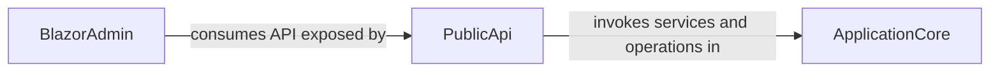

## Details

One paragraph explaining the functionality which is represented by this graph. What the main flow is and what is its purpose.

### PublicApi [[Expand]](./PublicApi.md)
The PublicApi component serves as the primary external interface for the e-commerce system, exposing a comprehensive RESTful API. It acts as a facade, receiving API requests from external clients (including the BlazorAdmin component) and translating them into appropriate calls to the business logic and services residing within the ApplicationCore. This component is crucial for enabling programmatic interaction with the system, supporting integration with other applications, and providing the backend for client-side applications.

**Related Classes/Methods**:

- `PublicApi` (1:1)

### ApplicationCore [[Expand]](./ApplicationCore.md)
The ApplicationCore component encapsulates the core business logic and domain model of the e-commerce system. It defines the entities, aggregates, domain services, and specifications that represent the heart of the application's functionality. This component is responsible for enforcing business rules, managing data integrity, and orchestrating complex operations. It is consumed by the PublicApi for executing business operations.

**Related Classes/Methods**:

- `ApplicationCore` (1:1)

### BlazorAdmin [[Expand]](./BlazorAdmin.md)
The BlazorAdmin component represents the administrative user interface of the e-commerce system, built using Blazor. It provides a web-based interface for managing various aspects of the e-commerce platform, such as catalog items, orders, and user accounts. This component interacts with the PublicApi to retrieve and manipulate data, offering a rich and interactive experience for administrators.

**Related Classes/Methods**:

- `BlazorAdmin` (1:1)

### [FAQ](https://github.com/CodeBoarding/GeneratedOnBoardings/tree/main?tab=readme-ov-file#faq)