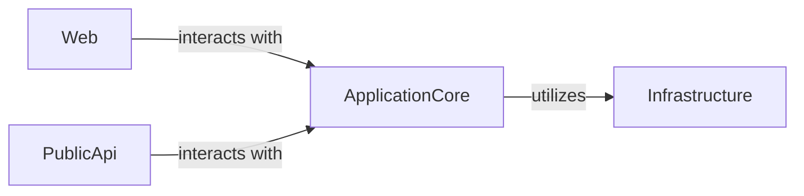

## Details

One paragraph explaining the functionality which is represented by this graph. What the main flow is and what is its purpose.

### ApplicationCore [[Expand]](./ApplicationCore.md)
This component encapsulates the core business logic, domain models, and application services of the e-commerce system. It defines the essential operations and rules for managing products, orders, users, and other domain entities, acting as the central orchestrator for business processes.

**Related Classes/Methods**: _None_

### Infrastructure [[Expand]](./Infrastructure.md)
Responsible for handling external concerns and technical implementations that support the `ApplicationCore`. This includes data persistence (e.g., database interactions), external service integrations (e.g., payment gateways, shipping APIs), messaging, and other cross-cutting technical functionalities. It provides necessary services to the `ApplicationCore` without containing business logic itself.

**Related Classes/Methods**: _None_

### Web [[Expand]](./Web.md)
This component represents the user-facing interface of the e-commerce application, typically a web application. It handles HTTP requests, manages user sessions, renders dynamic content, and translates user interactions into calls to the `ApplicationCore`'s services. It focuses on presentation and user experience.

**Related Classes/Methods**: _None_

### PublicApi [[Expand]](./PublicApi.md)
Provides a programmatic interface for external clients or other systems to interact with the e-commerce application. This component exposes a set of well-defined endpoints (e.g., RESTful APIs) that allow for operations like product catalog retrieval, order placement, and user management, acting as a gateway to the `ApplicationCore`'s functionalities.

**Related Classes/Methods**: _None_

### [FAQ](https://github.com/CodeBoarding/GeneratedOnBoardings/tree/main?tab=readme-ov-file#faq)