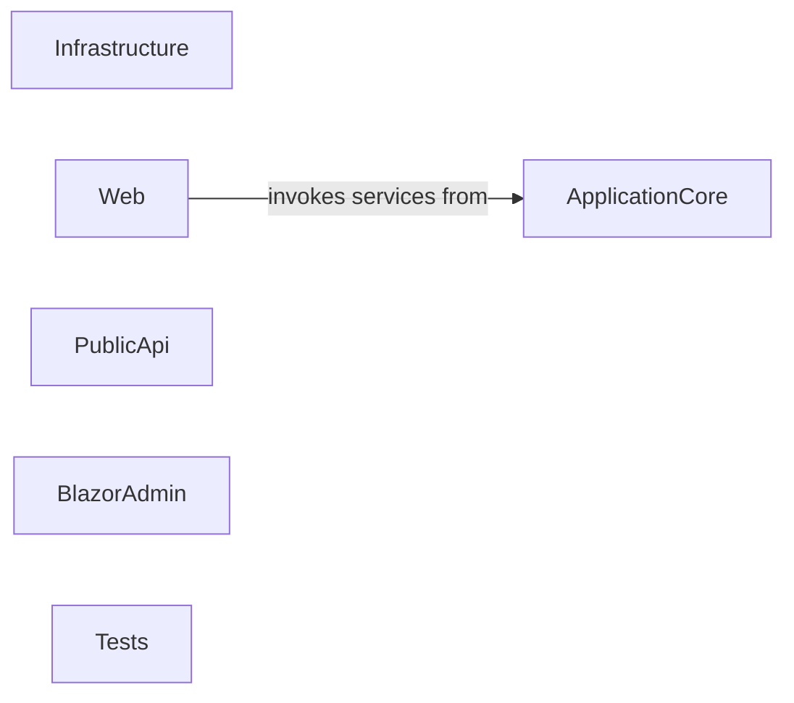

## Details

High-level architectural overview of a .NET e-commerce application, focusing on abstract components and their relationships.

### ApplicationCore [[Expand]](./ApplicationCore.md)
Encapsulates the core business logic, domain models, application services, and interfaces for repositories. It is technology-agnostic and represents the heart of the e-commerce domain.

**Related Classes/Methods**: _None_

### Infrastructure [[Expand]](./Infrastructure.md)
Implements the interfaces defined in ApplicationCore for data persistence (using Entity Framework Core) and integrates with external services. It handles the technical details of data access and external communication.

**Related Classes/Methods**: _None_

### Web [[Expand]](./Web.md)
The Web component is the user-facing presentation layer of the e-commerce application. It is built using ASP.NET Core MVC/Razor Pages, responsible for rendering dynamic web pages, processing user input from forms, and managing the overall user experience. It acts as the orchestrator for user interactions, translating them into calls to the underlying business logic.

**Related Classes/Methods**: _None_

### PublicApi [[Expand]](./PublicApi.md)
A dedicated presentation layer exposing a RESTful API for external clients and integrations. It provides programmatic access to the e-commerce functionalities.

**Related Classes/Methods**: _None_

### BlazorAdmin [[Expand]](./BlazorAdmin.md)
A separate presentation layer built with Blazor WebAssembly, providing an administrative interface for managing products, orders, and other e-commerce entities.

**Related Classes/Methods**: _None_

### Tests [[Expand]](./Tests.md)
Contains various testing projects (e.g., Unit Tests, Integration Tests, Functional Tests) to ensure the quality, correctness, and reliability of the application's components.

**Related Classes/Methods**: _None_

### [FAQ](https://github.com/CodeBoarding/GeneratedOnBoardings/tree/main?tab=readme-ov-file#faq)