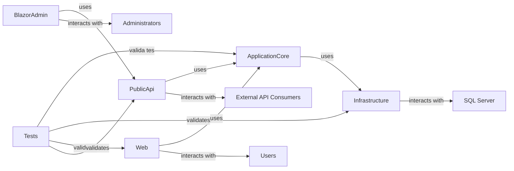

## Details

One paragraph explaining the functionality which is represented by this graph. What the main flow is and what is its purpose.

### ApplicationCore [[Expand]](./ApplicationCore.md)
Encapsulates the core business logic, domain models, and application services. It defines interfaces for data access and orchestrates business operations, acting as the central hub for the application's domain.

**Related Classes/Methods**: _None_

### Infrastructure [[Expand]](./Infrastructure.md)
Implements data access logic (e.g., Entity Framework Core for SQL Server) and integrates with external services (e.g., identity, email). It provides concrete implementations for interfaces defined in `ApplicationCore`.

**Related Classes/Methods**: _None_

### Web [[Expand]](./Web.md)
The primary presentation layer for the main e-commerce website, handling user interface rendering, user input, and presentation logic using ASP.NET Core MVC/Razor Pages. It interacts with `ApplicationCore` to fulfill user requests.

**Related Classes/Methods**: _None_

### PublicApi [[Expand]](./PublicApi.md)
Exposes a RESTful API for external clients or other applications to programmatically interact with the e-commerce system. It acts as a facade, translating API requests into calls to `ApplicationCore`.

**Related Classes/Methods**: _None_

### BlazorAdmin [[Expand]](./BlazorAdmin.md)
A client-side Blazor WebAssembly application providing an administrative user interface for managing the e-commerce system. It primarily communicates with the `PublicApi` to perform administrative tasks.

**Related Classes/Methods**: _None_

### Tests [[Expand]](./Tests.md)
Contains various testing projects (unit, integration, functional) to ensure the quality, correctness, and reliability of the `ApplicationCore`, `Infrastructure`, `Web`, and `PublicApi` components.

**Related Classes/Methods**: _None_

### SQL Server
An external relational database management system used by the `Infrastructure` component for persistent data storage.

**Related Classes/Methods**: _None_

### Users
External human users who interact with the `Web` application (the main e-commerce website).

**Related Classes/Methods**: _None_

### External API Consumers
External applications or services that programmatically interact with the e-commerce system via the `PublicApi`.

**Related Classes/Methods**: _None_

### Administrators
External human users with administrative privileges who manage the e-commerce system through the `BlazorAdmin` application.

**Related Classes/Methods**: _None_

### [FAQ](https://github.com/CodeBoarding/GeneratedOnBoardings/tree/main?tab=readme-ov-file#faq)