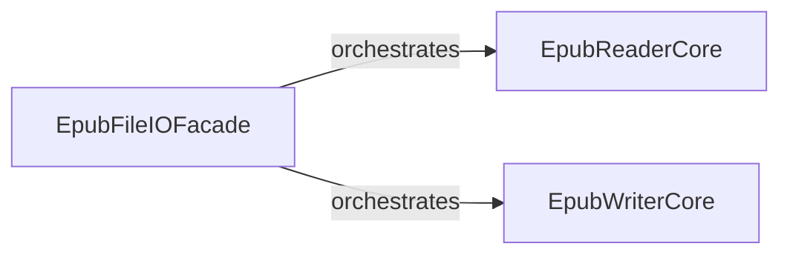

## Details

The `ebooklib` project's core functionality for handling EPUB files is structured around a clear separation of concerns. The `EpubFileIOFacade` acts as the primary entry point, providing high-level `read_epub` and `write_epub` functions. This facade delegates the complex tasks of parsing and loading EPUB content to the `EpubReaderCore`, which internally manages the extraction and in-memory representation of EPUB components. Conversely, for writing operations, the `EpubFileIOFacade` delegates to the `EpubWriterCore`, responsible for serializing the in-memory representation back into a valid EPUB file. Both `EpubReaderCore` and `EpubWriterCore` heavily rely on the internal methods within the `ebooklib.epub` module to perform their respective parsing and serialization duties, ensuring a cohesive and efficient EPUB file processing workflow.

### EpubFileIOFacade
This component serves as the primary high-level interface for users to interact with EPUB file operations. It orchestrates the overall reading and writing workflows, acting as the gateway for EPUB data. It abstracts away the complexities of the underlying parsing and serialization.

**Related Classes/Methods**:

- <a href="https://github.com/aerkalov/ebooklib/blob/master/ebooklib/epub.py" target="_blank" rel="noopener noreferrer">`ebooklib.epub:read_epub`</a>
- <a href="https://github.com/aerkalov/ebooklib/blob/master/ebooklib/epub.py" target="_blank" rel="noopener noreferrer">`ebooklib.epub:write_epub`</a>

### EpubReaderCore
Encapsulates the detailed logic for parsing and interpreting the internal structure of an EPUB file (which is essentially a ZIP archive). It extracts the EPUB's components (e.g., content files, metadata, manifest) and constructs an in-memory representation of the book. This component embodies the "Parser" pattern, primarily utilizing internal loading mechanisms within the `ebooklib.epub` module.

**Related Classes/Methods**:

- <a href="https://github.com/aerkalov/ebooklib/blob/master/ebooklib/epub.py" target="_blank" rel="noopener noreferrer">`ebooklib.epub:load`</a>
- <a href="https://github.com/aerkalov/ebooklib/blob/master/ebooklib/epub.py" target="_blank" rel="noopener noreferrer">`ebooklib.epub:_load_container`</a>
- <a href="https://github.com/aerkalov/ebooklib/blob/master/ebooklib/epub.py" target="_blank" rel="noopener noreferrer">`ebooklib.epub:_load_opf_file`</a>

### EpubWriterCore
Encapsulates the detailed logic for constructing and serializing an in-memory EPUB representation back into a valid EPUB file format (ZIP archive). This component embodies the "Serializer" and "Builder" patterns, primarily utilizing internal writing mechanisms within the `ebooklib.epub` module.

**Related Classes/Methods**:

- <a href="https://github.com/aerkalov/ebooklib/blob/master/ebooklib/epub.py" target="_blank" rel="noopener noreferrer">`ebooklib.epub:write`</a>
- <a href="https://github.com/aerkalov/ebooklib/blob/master/ebooklib/epub.py" target="_blank" rel="noopener noreferrer">`ebooklib.epub:_write_items`</a>
- <a href="https://github.com/aerkalov/ebooklib/blob/master/ebooklib/epub.py" target="_blank" rel="noopener noreferrer">`ebooklib.epub:_write_container`</a>
- <a href="https://github.com/aerkalov/ebooklib/blob/master/ebooklib/epub.py" target="_blank" rel="noopener noreferrer">`ebooklib.epub:_write_opf`</a>

### [FAQ](https://github.com/CodeBoarding/GeneratedOnBoardings/tree/main?tab=readme-ov-file#faq)