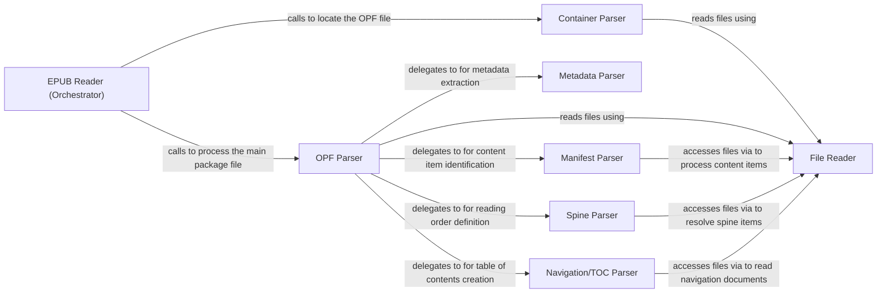

## Details

The `EPUB Parser` subsystem is the core engine responsible for transforming raw EPUB file data into the structured in-memory `EpubBook` Object Model. It orchestrates the parsing of various EPUB components, including the container, OPF (Open Packaging Format), manifest, spine, and navigation structures.

### EPUB Reader (Orchestrator)
The primary interface for initiating the EPUB parsing process. It orchestrates the high-level flow, coordinating calls to other specialized parsers to build the `EpubBook` object from the EPUB archive.

**Related Classes/Methods**:

- <a href="https://github.com/aerkalov/ebooklib/blob/master/ebooklib/epub.py" target="_blank" rel="noopener noreferrer">`ebooklib.readers.EpubReader`</a>
- <a href="https://github.com/aerkalov/ebooklib/blob/master/ebooklib/epub.py" target="_blank" rel="noopener noreferrer">`ebooklib.readers.EpubReader._load`</a>

### Container Parser
Responsible for parsing the `container.xml` file within the EPUB archive. Its main task is to locate the path of the crucial OPF (Open Packaging Format) file, which serves as the central metadata and content manifest for the EPUB.

**Related Classes/Methods**:

- <a href="https://github.com/aerkalov/ebooklib/blob/master/ebooklib/epub.py" target="_blank" rel="noopener noreferrer">`ebooklib.readers._load_container`</a>

### OPF Parser
The central dispatcher for parsing the OPF file. This component interprets the core structure of the EPUB, defining its metadata, manifest (content items), and spine (reading order). It delegates the parsing of specific sections to dedicated sub-parsers.

**Related Classes/Methods**:

- <a href="https://github.com/aerkalov/ebooklib/blob/master/ebooklib/epub.py" target="_blank" rel="noopener noreferrer">`ebooklib.readers._load_opf_file`</a>

### Metadata Parser
Extracts and processes Dublin Core metadata elements (e.g., title, author, language, publisher) from the OPF file. It populates the `EpubBook` object's metadata attributes, providing essential descriptive information about the EPUB.

**Related Classes/Methods**:

- <a href="https://github.com/aerkalov/ebooklib/blob/master/ebooklib/epub.py" target="_blank" rel="noopener noreferrer">`ebooklib.readers._load_metadata`</a>

### Manifest Parser
Identifies and creates `EpubItem` objects for all content files (HTML, CSS, images, fonts) listed in the OPF manifest section. These items represent the individual assets and resources that constitute the EPUB's content.

**Related Classes/Methods**:

- <a href="https://github.com/aerkalov/ebooklib/blob/master/ebooklib/epub.py" target="_blank" rel="noopener noreferrer">`ebooklib.readers._load_manifest`</a>

### Spine Parser
Interprets the spine section of the OPF, which defines the linear reading order of the EPUB's main content documents. This component determines the sequence in which content should be presented to the reader, crucial for sequential reading experiences.

**Related Classes/Methods**:

- <a href="https://github.com/aerkalov/ebooklib/blob/master/ebooklib/epub.py" target="_blank" rel="noopener noreferrer">`ebooklib.readers._load_spine`</a>

### Navigation/TOC Parser
Handles the parsing of navigation structures within the EPUB. This includes parsing the NCX (Navigation Control file for XML) for EPUB2 files and the `nav.xhtml` document for EPUB3, both of which are used to construct the EPUB's table of contents and other navigational aids.

**Related Classes/Methods**:

- <a href="https://github.com/aerkalov/ebooklib/blob/master/ebooklib/epub.py" target="_blank" rel="noopener noreferrer">`ebooklib.readers._parse_ncx`</a>
- <a href="https://github.com/aerkalov/ebooklib/blob/master/ebooklib/epub.py" target="_blank" rel="noopener noreferrer">`ebooklib.readers._parse_nav`</a>

### File Reader
Provides a low-level utility to read raw byte content from specific files within the EPUB archive (which is essentially a ZIP file). It abstracts the underlying file access, serving as a foundational service for all higher-level parsers.

**Related Classes/Methods**:

- <a href="https://github.com/aerkalov/ebooklib/blob/master/ebooklib/epub.py#L1440-L1443" target="_blank" rel="noopener noreferrer">`ebooklib.epub.read_file`:1440-1443</a>

### [FAQ](https://github.com/CodeBoarding/GeneratedOnBoardings/tree/main?tab=readme-ov-file#faq)