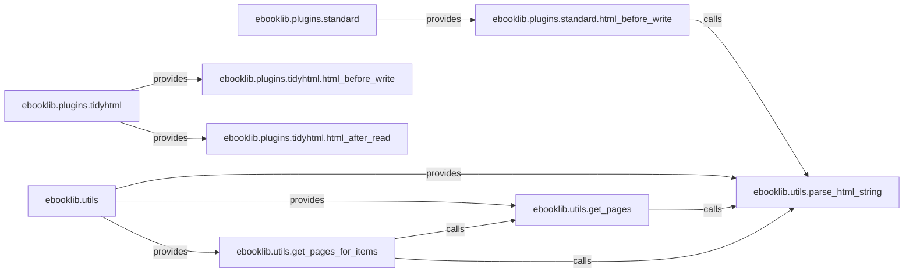

## Details

The ebooklib project's content processing subsystem is primarily composed of ebooklib.plugins.standard, ebooklib.plugins.tidyhtml, and ebooklib.utils. The standard and tidyhtml plugins are responsible for transforming and cleaning HTML content at different stages of the EPUB creation or parsing process, specifically before writing and after reading. These plugins leverage the core utilities provided by ebooklib.utils. The ebooklib.utils component offers fundamental functionalities such as parse_html_string for converting raw HTML into a manipulable structure and get_pages and get_pages_for_items for extracting page-related information. This architecture ensures a modular and extensible approach to content manipulation, allowing for various HTML processing steps to be applied through a plugin-based system, all underpinned by a set of robust HTML utility functions.

### ebooklib.plugins.standard
Manages standard, pre-defined HTML content transformations. It acts as a container for common plugin functionalities that modify HTML before serialization.

**Related Classes/Methods**:

- <a href="https://github.com/aerkalov/ebooklib/blob/master/ebooklib/plugins/standard.py#L1-L9999" target="_blank" rel="noopener noreferrer">`ebooklib.plugins.standard`:1-9999</a>

### ebooklib.plugins.tidyhtml
Manages HTML cleaning and tidying operations. This component encapsulates functionalities for ensuring HTML content is well-formed and consistent.

**Related Classes/Methods**:

- <a href="https://github.com/aerkalov/ebooklib/blob/master/ebooklib/plugins/tidyhtml.py#L1-L9999" target="_blank" rel="noopener noreferrer">`ebooklib.plugins.tidyhtml`:1-9999</a>

### ebooklib.utils
Provides a collection of general-purpose content manipulation and extraction utilities. This component offers foundational helper functions for various content-related tasks.

**Related Classes/Methods**:

- <a href="https://github.com/aerkalov/ebooklib/blob/master/ebooklib/utils.py#L1-L9999" target="_blank" rel="noopener noreferrer">`ebooklib.utils`:1-9999</a>

### ebooklib.plugins.standard.html_before_write
A specific plugin hook for applying standard HTML modifications before content serialization. It represents an extension point in the content writing pipeline.

**Related Classes/Methods**:

- <a href="https://github.com/aerkalov/ebooklib/blob/master/ebooklib/plugins/standard.py#L36-L39" target="_blank" rel="noopener noreferrer">`ebooklib.plugins.standard.leave_only`:36-39</a>

### ebooklib.plugins.tidyhtml.html_before_write
A plugin hook for tidying HTML content before serialization. This hook ensures content cleanliness prior to being written to an EPUB file.

**Related Classes/Methods**:

- <a href="https://github.com/aerkalov/ebooklib/blob/master/ebooklib/plugins/tidyhtml.py#L26-L54" target="_blank" rel="noopener noreferrer">`ebooklib.plugins.tidyhtml.tidy_cleanup`:26-54</a>

### ebooklib.plugins.tidyhtml.html_after_read
A plugin hook for tidying HTML content immediately after parsing. This hook ensures content cleanliness as soon as it's read into the system.

**Related Classes/Methods**:

- <a href="https://github.com/aerkalov/ebooklib/blob/master/ebooklib/plugins/tidyhtml.py#L26-L54" target="_blank" rel="noopener noreferrer">`ebooklib.plugins.tidyhtml.tidy_cleanup`:26-54</a>

### ebooklib.utils.parse_html_string
A fundamental utility for parsing raw HTML strings into a structured, manipulable format (e.g., a DOM-like object). It's a core building block for HTML processing.

**Related Classes/Methods**:

- <a href="https://github.com/aerkalov/ebooklib/blob/master/ebooklib/utils.py#L43-L50" target="_blank" rel="noopener noreferrer">`ebooklib.utils.parse_html_string`:43-50</a>

### ebooklib.utils.get_pages
A utility for extracting and structuring page-related information from HTML content. It leverages HTML parsing to derive page breaks or content sections.

**Related Classes/Methods**:

- <a href="https://github.com/aerkalov/ebooklib/blob/master/ebooklib/utils.py#L84-L92" target="_blank" rel="noopener noreferrer">`ebooklib.utils.get_headers`:84-92</a>

### ebooklib.utils.get_pages_for_items
Orchestrates calls to foundational content extraction utilities for multiple items.

**Related Classes/Methods**:

- <a href="https://github.com/aerkalov/ebooklib/blob/master/ebooklib/utils.py#L118-L121" target="_blank" rel="noopener noreferrer">`ebooklib.utils.get_pages_for_items`:118-121</a>

### [FAQ](https://github.com/CodeBoarding/GeneratedOnBoardings/tree/main?tab=readme-ov-file#faq)