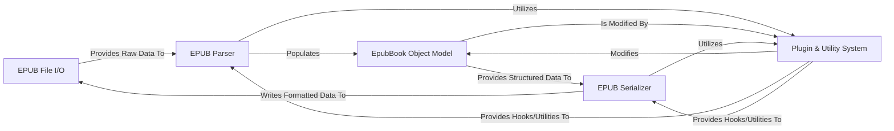

## Details

The ebooklib project is structured around a clear data flow for EPUB file processing. The EPUB File I/O component serves as the primary interface for reading from and writing to physical EPUB (ZIP) files. Upon reading, raw data is passed to the EPUB Parser, which is responsible for transforming this data into a structured, in-memory representation known as the EpubBook Object Model. This object model acts as the central data hub, holding all content, metadata, and structural information of the EPUB book.

For writing EPUB files, the EPUB Serializer takes the EpubBook Object Model and converts it back into the valid EPUB file format, which is then handled by the EPUB File I/O component for physical writing. Throughout both parsing and serialization, the Plugin & Utility System provides extensible functionality and helper methods, allowing for modifications to the EpubBook Object Model and offering hooks for custom processing. This modular design ensures a clear separation of concerns, facilitating maintainability and extensibility, and provides a straightforward flow for diagrammatic representation.

### EPUB File I/O [[Expand]](./EPUB_File_I_O.md)
Manages the low-level reading from and writing to the physical EPUB file (ZIP archive). It acts as the gateway for EPUB data.

**Related Classes/Methods**:

- <a href="https://github.com/aerkalov/ebooklib/blob/master/ebooklib/epub.py" target="_blank" rel="noopener noreferrer">`ebooklib.epub:read_epub`</a>
- <a href="https://github.com/aerkalov/ebooklib/blob/master/ebooklib/epub.py" target="_blank" rel="noopener noreferrer">`ebooklib.epub:write_epub`</a>
- <a href="https://github.com/aerkalov/ebooklib/blob/master/ebooklib/epub.py" target="_blank" rel="noopener noreferrer">`ebooklib.readers.EpubReader`</a>
- <a href="https://github.com/aerkalov/ebooklib/blob/master/ebooklib/epub.py" target="_blank" rel="noopener noreferrer">`ebooklib.writers.EpubWriter`</a>

### EPUB Parser [[Expand]](./EPUB_Parser.md)
The core engine for transforming raw EPUB file data into the structured in-memory EpubBook Object Model. It orchestrates the parsing of various EPUB components (container, OPF, manifest, spine, navigation).

**Related Classes/Methods**:

- <a href="https://github.com/aerkalov/ebooklib/blob/master/ebooklib/epub.py" target="_blank" rel="noopener noreferrer">`ebooklib.readers.EpubReader._load`</a>
- <a href="https://github.com/aerkalov/ebooklib/blob/master/ebooklib/epub.py" target="_blank" rel="noopener noreferrer">`ebooklib.readers._load_container`</a>
- <a href="https://github.com/aerkalov/ebooklib/blob/master/ebooklib/epub.py" target="_blank" rel="noopener noreferrer">`ebooklib.readers._load_opf_file`</a>

### EpubBook Object Model [[Expand]](./EpubBook_Object_Model.md)
The central, in-memory data structure representing the entire EPUB book. It holds all content, metadata, and structural information, acting as the hub for data manipulation. This component implicitly includes individual EpubItem content objects.

**Related Classes/Methods**:

- <a href="https://github.com/aerkalov/ebooklib/blob/master/ebooklib/epub.py#L568-L880" target="_blank" rel="noopener noreferrer">`ebooklib.epub.EpubBook`:568-880</a>
- <a href="https://github.com/aerkalov/ebooklib/blob/master/ebooklib/epub.py" target="_blank" rel="noopener noreferrer">`ebooklib.epub.EpubBook.add_item`</a>
- <a href="https://github.com/aerkalov/ebooklib/blob/master/ebooklib/epub.py" target="_blank" rel="noopener noreferrer">`ebooklib.epub.EpubBook.set_title`</a>
- <a href="https://github.com/aerkalov/ebooklib/blob/master/ebooklib/epub.py#L243-L464" target="_blank" rel="noopener noreferrer">`ebooklib.epub.EpubHtml`:243-464</a>
- <a href="https://github.com/aerkalov/ebooklib/blob/master/ebooklib/epub.py#L538-L551" target="_blank" rel="noopener noreferrer">`ebooklib.epub.EpubImage`:538-551</a>

### EPUB Serializer
Responsible for transforming the in-memory EpubBook Object Model back into a valid EPUB file format. It generates necessary XML files and writes all content items into the EPUB archive.

**Related Classes/Methods**:

- <a href="https://github.com/aerkalov/ebooklib/blob/master/ebooklib/epub.py" target="_blank" rel="noopener noreferrer">`ebooklib.writers.EpubWriter.process`</a>
- <a href="https://github.com/aerkalov/ebooklib/blob/master/ebooklib/epub.py" target="_blank" rel="noopener noreferrer">`ebooklib.writers._write_opf`</a>
- <a href="https://github.com/aerkalov/ebooklib/blob/master/ebooklib/epub.py" target="_blank" rel="noopener noreferrer">`ebooklib.writers._write_items`</a>

### Plugin & Utility System [[Expand]](./Plugin_Utility_System.md)
Provides a flexible mechanism for extending the library's functionality through plugins (e.g., html_before_write, html_after_read) and offers helper functions for manipulating content within EpubItem objects.

**Related Classes/Methods**:

- <a href="https://github.com/aerkalov/ebooklib/blob/master/ebooklib/plugins/standard.py" target="_blank" rel="noopener noreferrer">`ebooklib.plugins.standard`</a>
- <a href="https://github.com/aerkalov/ebooklib/blob/master/ebooklib/plugins/tidyhtml.py" target="_blank" rel="noopener noreferrer">`ebooklib.plugins.tidyhtml`</a>
- <a href="https://github.com/aerkalov/ebooklib/blob/master/ebooklib/utils.py#L95-L115" target="_blank" rel="noopener noreferrer">`ebooklib.utils.get_pages`:95-115</a>
- <a href="https://github.com/aerkalov/ebooklib/blob/master/ebooklib/utils.py#L43-L50" target="_blank" rel="noopener noreferrer">`ebooklib.utils.parse_html_string`:43-50</a>

### [FAQ](https://github.com/CodeBoarding/GeneratedOnBoardings/tree/main?tab=readme-ov-file#faq)