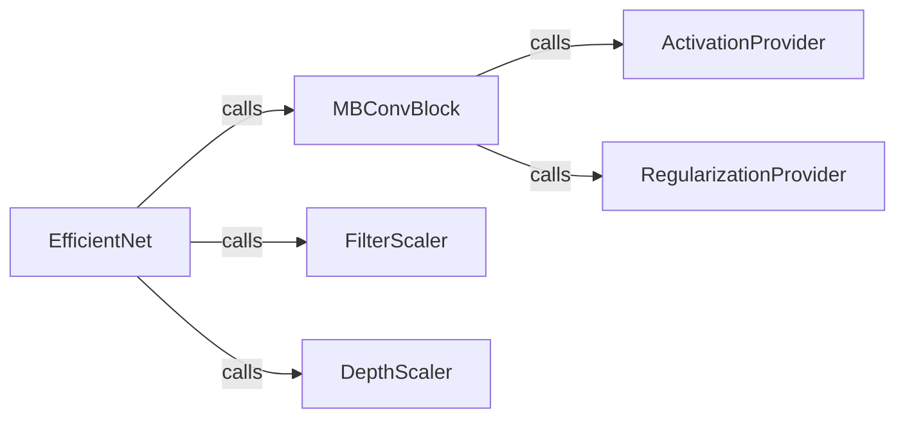

## Details

The `EfficientNet Core Architecture` subsystem is primarily defined by the `efficientnet/model.py` file, encompassing the core `EfficientNet` model definition and its foundational building blocks and utility functions.

### EfficientNet
The primary entry point for users to instantiate and configure various EfficientNet model variants (e.g., B0-B7). It orchestrates the entire model construction process, applying compound scaling principles to adjust network width, depth, and resolution, and handles the loading of pre-trained weights. This is the central model definition component.

**Related Classes/Methods**:

- <a href="https://github.com/qubvel/efficientnet/blob/master/efficientnet/model.py#L248-L460" target="_blank" rel="noopener noreferrer">`EfficientNet`:248-460</a>

### MBConvBlock
Implements the Mobile Inverted Bottleneck Convolution (MBConv) block, which is the fundamental and highly reusable building block of the EfficientNet architecture. It incorporates depthwise separable convolutions, squeeze-and-excitation (SE) modules, and skip connections. This is a key reusable building block.

**Related Classes/Methods**:

- <a href="https://github.com/qubvel/efficientnet/blob/master/efficientnet/model.py#L161-L245" target="_blank" rel="noopener noreferrer">`mb_conv_block`:161-245</a>

### FilterScaler
A utility function responsible for dynamically scaling the number of filters for convolutional layers based on the compound scaling `width_coefficient`. This ensures that the model's width is adjusted consistently across different EfficientNet variants. This is a core utility for model configuration.

**Related Classes/Methods**:

- <a href="https://github.com/qubvel/efficientnet/blob/master/efficientnet/model.py#L143-L152" target="_blank" rel="noopener noreferrer">`round_filters`:143-152</a>

### DepthScaler
A utility function that dynamically scales the number of repetitions for each MBConv block based on the compound scaling `depth_coefficient`. This contributes to the depth scaling of the model. This is a core utility for model configuration.

**Related Classes/Methods**:

- <a href="https://github.com/qubvel/efficientnet/blob/master/efficientnet/model.py#L155-L158" target="_blank" rel="noopener noreferrer">`round_repeats`:155-158</a>

### ActivationProvider
A utility function that provides the Swish activation function, a non-linear activation commonly used in EfficientNet for improved performance. This is a foundational utility for neural network operations.

**Related Classes/Methods**:

- <a href="https://github.com/qubvel/efficientnet/blob/master/efficientnet/model.py#L99-L117" target="_blank" rel="noopener noreferrer">`get_swish`:99-117</a>

### RegularizationProvider
A utility function that provides a dropout layer for regularization within the MBConv blocks, helping to prevent overfitting. This is a foundational utility for neural network operations.

**Related Classes/Methods**:

- <a href="https://github.com/qubvel/efficientnet/blob/master/efficientnet/model.py#L120-L140" target="_blank" rel="noopener noreferrer">`get_dropout`:120-140</a>

### [FAQ](https://github.com/CodeBoarding/GeneratedOnBoardings/tree/main?tab=readme-ov-file#faq)